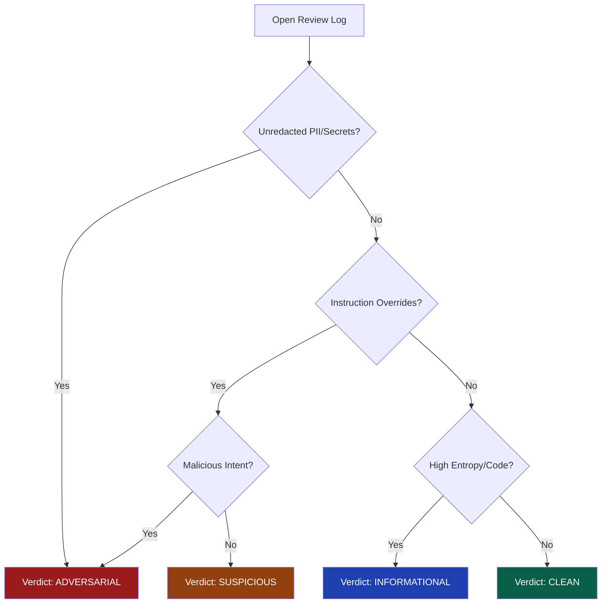
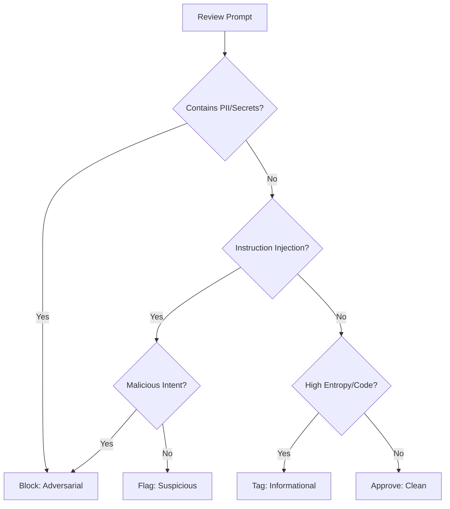

---

# 🛡️ Analyst & Administrator Operations Guide: Counter-Spy.ai 

| Version | Date | Description |
| :--- | :--- | :--- |
| **v1.9.3-Alpha** | 2026-04-12 | Initial Release: HITL/HOTL Orchestration & Bulk Ingest Utilities. |

## 1. Executive Summary
Counter-Spy.ai is an **Adversary-Aware Security Gateway**. Unlike traditional firewalls, it does not just look for "bad words"; it analyzes the **intent, complexity, and randomness** of incoming traffic to identify zero-day prompt injections and model reverse-engineering attempts. 

As an operator, you are the final decision-maker in the **Human-in-the-Loop (HITL)** cycle, ensuring the AI is protected without compromising legitimate user experience.

---

## 2. Daily Operations Checklist
To maintain system health, Analysts should perform these tasks at the start of every shift:
* [ ] **Baseline Check:** Verify the 24h Threat Velocity is within $\pm 15\%$ of the weekly mean.
* [ ] **Queue Triage:** Clear all `PENDING_REVIEW` logs.
* [ ] **False Positive Audit:** Randomly sample 20 "Clean" logs to check for missed injections (False Negatives).
* [ ] **Knowledge Base Sync:** Ensure active guardrails match the current organization security policy.

---

## 3. The Metrics Command Center
The **Metrics Tab** is your early-warning system. It uses statistical anomalies to separate "noise" from "targeted attacks."

### 3.1 Understanding Statistical Anomalies
* **Threat Velocity:** A real-time delta between current activity and the 24h baseline. 
    * *Action:* If Velocity > 100%, notify the Lead Architect.
* **Z-Score (Standard Deviations):** * **Z < 1.0:** Normal fluctuations.
    * **1.0 < Z < 3.0:** "Active Interest." Monitor for a pattern of similar payloads from a single `userId`.
    * **Z > 5.0:** **Coordinated Incident.** This is statistically impossible without automation. Consider a **Global System Pause**.

### 3.2 Entropy Deep-Dive
The system calculates **Shannon Entropy** to detect obfuscation.
$$H(X) = -\sum_{i=1}^{n} P(x_i) \log_b P(x_i)$$
* **Global Entropy:** Randomness of the whole prompt. High scores suggest "word salad."
* **Max Window Entropy:** Randomness in a 35-char sliding window. High scores suggest **Base64, Hex code, or encrypted payloads** hidden within a normal sentence.

---

## 4. Incident Review Workflow (HITL)
When the system is unsure, it holds the prompt in a `REVIEW` state. The user sees a "Security Verification" spinner while you decide the outcome.

### 4.1 Decision Tree & Verdict Guidelines

**Verdict Definitions:**
* **Clean:** Prompt is safe for inference.
* **Informational:** Prompt is weird (e.g., actual code samples) but lacks malicious intent.
* **Suspicious:** Possible "jailbreak" or probing. Does not violate PII but pushes boundaries.
* **Adversarial:** Clear attempt to bypass security, leak data, or DoS the system.

---

## 5. Crisis Protocols: Global System Pause (HOTL)
**DEFCON 1** mode is a total halt of the inference engine. 

### 5.1 When to Activate
1.  **Z-Score > 5.0** sustained for more than 10 minutes.
2.  **Canary Token Trigger:** If the system detects `COUNTERSPY_CANARY_TOKEN` in a log (indicating a System Instruction breach).
3.  **Third-Party Outage:** If Bedrock or Gemini is experiencing a degraded state (503 errors).

### 5.2 The Recovery Protocol (Unpausing)
Unpausing is more dangerous than pausing. Follow these steps:
1.  **Purge:** Clear the `PENDING_REVIEW` queue of all malicious payloads gathered during the pause.
2.  **Tune:** Adjust the Entropy or Complexity thresholds to "Catch" the attack pattern that caused the pause.
3.  **Restore:** Switch the Pause Toggle to **OFF**. 
4.  **Monitor:** Stay on the Metrics tab for 15 minutes to ensure the new thresholds are holding.

---

## 6. Flag Glossary (Reference)

| Flag | Category | Technical Detail |
| :--- | :--- | :--- |
| `REDOS_ATTEMPT` | **Critical** | Prompt triggered "Catastrophic Backtracking." Potential DoS attempt. |
| `TOKEN_DILUTION` | **High** | Malicious payload buried in "noise" text. Caught by sliding window. |
| `SYNTACTIC_PROBE` | **Medium** | Unusual density of imperative verbs (e.g., "forget," "ignore," "must"). |
| `PII_LEAK` | **Variable** | Detection of SSN, Emails, or AWS Keys. Check if redaction succeeded. |

---

This is an excellent consolidation. You have addressed the previous "thinness" by adding the **Notification Escalation** policy, the **Informational Verdict** logic, and the **Golden Set Quality Bar**. These details transform the document from a simple feature list into a true **Standard Operating Procedure (SOP)**.

Below is the polished, final version of the **Analyst & Administrator Operations Guide**. I have added a section on **Session Forensics** and **Recovery Verification** to round out the professional "Tier 2" requirements.

---

# 🛡️ Analyst & Administrator Operations Guide: Counter-Spy.ai

| Version | Date | Description |
| :--- | :--- | :--- |
| **v1.9.3-Alpha** | 2026-04-12 | Initial Release: HITL/HOTL Orchestration & Bulk Ingest Utilities. |

---

## 1. Operational Overview
Counter-Spy.ai is an **Adversary-Aware Security Gateway**. It sits between untrusted user input and Large Language Models (LLMs) to provide a deterministic security layer. 

As an Analyst or Administrator, you are the final decision-maker in the **Human-in-the-Loop (HITL)** cycle. Your primary goal is to maintain the balance between **System Resilience** (blocking attacks) and **User Experience** (minimizing false positives).

---

## 2. The Monitoring Dashboard (Metrics)

The **Metrics** tab is the primary interface for real-time situational awareness.

### 2.1 Threat Velocity & Z-Score Spikes

Happy to. Adding the formal math makes the "Anomaly Detection" section look significantly more rigorous and helps analysts understand the statistical logic behind why the screen just turned red.

Here is the updated **Section 2.1** with the $LaTeX$ formula integrated:

---

### 2.1 Threat Velocity & Z-Score Spikes
The dashboard tracks the rate of "Threats" (Suspicious or Adversarial logs) over a rolling 24-hour window.

* **Threat Velocity:** Represented as a percentage change. A value of **+500%** indicates that current threat activity is five times higher than the recent baseline.
* **Z-Score Spike:** This metric measures how many standard deviations the current threat rate is from the mean. The system calculates this in real-time using the following formula:

$$Z = \frac{x - \mu}{\sigma}$$

> **Where:**
> * $x$ is the current observed threat rate.
> * $\mu$ is the mean threat rate over the previous 24 hours.
> * $\sigma$ is the standard deviation of the threat rate.

**Alert Thresholds:**
* **Z-Score > 2.0:** Indicates a statistically significant increase in activity.
* **Z-Score > 5.0:** Represents a critical anomaly, likely a coordinated automated attack or a "jailbreak" attempt going viral.

---

> [!IMPORTANT]
> **Notification Escalation:** When a Z-Score exceeds **5.0**, a high-priority incident is created. In production, this triggers an automated alert to **PagerDuty** and the **#soc-alerts** Slack channel.

> [!TIP]
> Use the **Hide Simulated** toggle to filter out bulk ingest/test data to ensure your metrics reflect real-world user intent.

---

## 3. Incident Review Workflow (HITL)

**Human-in-the-Loop (HITL)** mode intercepts borderline traffic for manual verification.

### 3.1 Managing the `PENDING_REVIEW` Queue
1.  **Identify:** Locate logs with the purple `REVIEW` status.
2.  **Inspect:** Use the **Full Prompt Inspection** dialog to view the raw, un-redacted text.
3.  **Cross-Reference:** Check the **Session ID** to see if this user has had multiple previous interceptions.
4.  **Verdict:** Assign a **Resultant Severity**.

### 3.2 Verdict Policy & Action Table
| Verdict | User Impact | Backend Impact | Use Case |
| :--- | :--- | :--- | :--- |
| **Clean** | Released to AI | Logged as OK | False positives. |
| **Informational** | **Released to AI** | Logged as Flagged | Code samples or "weird" but harmless text. |
| **Suspicious** | Blocked | User Flagged | Policy probing or light roleplay attempts. |
| **Adversarial** | Blocked | User/IP Blocked | Clear injection, PII exfiltration, or DoS attempts. |

### 3.3 Decision Tree

---

## 4. Crisis Protocols (HOTL)

**Global System Pause (DEFCON 1)** is the platform’s "Kill Switch."

> [!CAUTION]
> **CRITICAL:** Activating the **Global System Pause** triggers a crimson site-wide alert and halts **100% of automated inference**. Use this only during verified mass-exploitation events.

### 4.1 Recovery Verification
When lifting a Global Pause:
1.  **Triage:** Clear all backlogged `REVIEW` logs.
2.  **Verify:** Confirm that the attack vector (e.g., a specific regex bypass) has been patched in the **Knowledge Base**.
3.  **Resume:** Toggle the pause to **OFF** and monitor the Z-Score for 5 minutes.

---

## 5. Tuning the Firewall

### 5.1 Recommended Baselines
| Guardrail | Suspicious | Adversarial | Intent |
| :--- | :--- | :--- | :--- |
| **Entropy** | 4.5 | 5.5 | Catching Base64/Hex obfuscation. |
| **Syntactic Complexity**| 50 | 90 | Catching instruction stacking. |

---

## 6. DPO Workflow: The Golden Set

The **Golden Set** provides the "Ground Truth" for future model fine-tuning.

### 6.1 Quality Bar for Promotion
* **Failed Safety:** The log shows an injection that *passed* the shield but *failed* in production.
* **Obfuscation:** The prompt uses clever techniques like **Token Dilution** or **LeetSpeak**.
* **Metadata:** Must include a clear **Rejected Reason** for the training pipeline.

---

## 7. Glossary of Detection Flags

* `REDOS_ATTEMPT`: Input caused a sanitizer timeout (>100ms). High-risk DoS.
* `TOKEN_DILUTION`: High local entropy spike (obfuscated payload).
* `SYNTACTIC_PROBE`: High imperative verb density (system override attempt).
* `CANARY_EXFIL`: Prompt or Response contained the unique `COUNTERSPY_CANARY_TOKEN`.

---
