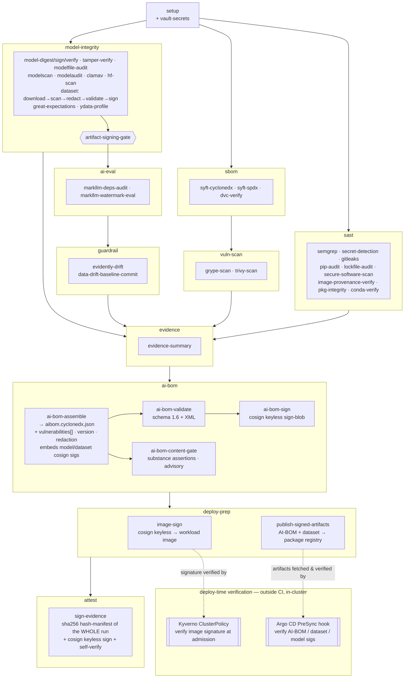

# MLSECDEVOPS GitLab Pipeline

Note: Vulnerable software libraries are intentional, with additional security risks planned for example reporting and demonstrations.

This repository contains the concrete artifacts and fixtures for the MLSECDEVOPS GitLab Pipeline. It is intentionally self-contained so it can run without production accounts, private credentials, gated models, or undefined assets.

**Approximate GitLab credit cost: 95 credits**

**Example model:** [Qwen2.5-1.5B-Instruct-GGUF](https://huggingface.co/Qwen/Qwen2.5-1.5B-Instruct-GGUF) — file `qwen2.5-1.5b-instruct-q2_k.gguf` (Q2_K quantization, ~718 MiB), pinned by SHA-256 as the model fixture.

## Repository File Tree

Every file tracked in this repo is part of the MLSECDEVOPS GitLab Pipeline; the unrelated app directories are **not** tracked here. This is the complete, authoritative layout:

```
mlsecdevops-pipeline/   (MLSECDEVOPS GitLab Pipeline — repo root)
├── .gitlab-ci.yml          ← the pipeline definition (static security pipeline)
├── requirements.txt        ← root runtime pins
├── requirements.hashed.txt ← hash-pinned root locks
├── .gitleaks.toml          ← secret-scan config
├── .gitignore
├── README.md  SETUP.md
├── ci/
│   ├── CI-VARIABLES.md  SBOM.md
│   └── requirements-ci{,-markllm,-dataquality}.{in,txt}  ← grouped CI dep locks
├── scripts/         Python scripts — build_ai_bom, run_evidently_report,
│                    write_ci_evidence_summary, redact_dataset,
│                    secure_software_scan, validate_eval_dataset, …
├── evals/           datasets + baselines + schema (model-baseline.json,
│                    dataset-baseline.json, dataset-reference.jsonl,
│                    gandalf-ignore-instructions-test.jsonl, eval-dataset.schema.json, …)
├── hugging-face-hub/  HF scan fixture + review guide
├── model-signing/   lab-model, tampered-model, signing fixture
└── deployment/
    ├── argocd/       application, appproject, verify-signatures PreSync hook
    ├── kubernetes/   rag-app, weaviate, network-policy, kyverno image-verify policy
    └── vault/        terraform/, gaips-policy.hcl, jwt-auth-config.hcl
└── assessments/
    ├── AI BOM Analysis.md
    ├── Threat Model.md
```

### Publishing to a Public GitHub Repo (hosting & sharing)

**CI continues to run in GitLab.** GitHub is a public mirror for hosting and sharing the product — not a second CI runner. `.gitlab-ci.yml` ships **as-is**: it documents the pipeline and executes in GitLab; GitHub simply displays it. No GitHub Actions port is intended. Before making the repo public:

- **Secret / identity hygiene (do this first).** Confirm nothing sensitive is committed: no PATs or tokens, no real internal hosts or signer identities (the committed examples use placeholders — e.g. the ArgoCD ConfigMap's `MODEL_SIGNING_IDENTITY: ci-signer@example.invalid`; the real value lives only in GitLab protected CI/CD variables, not in the repo), and fixtures/datasets contain only synthetic or sanitized data. The `gitleaks-scan` + `secret-detection` jobs already gate this in CI — confirm they're green before publishing.
- **Exclude internal working docs** from the public repo: `SESSION_HANDOFF.md`, `PIPELINE_JOB_VALIDATION.md`, `PIPELINE_FIX_PLAN_29-34.md`, `gitlab-pipeline-setup-notes.md` (session/working artifacts, not end-user material).
- **Add a `LICENSE`** for public distribution, and keep this README as the product entry point.
- Everything else — `scripts/`, `evals/`, `model-signing/`, `deployment/`, the `.md` docs, `requirements*.{in,txt}`, `.gitleaks.toml` — is shareable as-is.

## Directory Map

| Directory | Purpose |
| --- | --- |
| `evals/` | MarkLLM lab instructions/config plus eval datasets, baselines, and schema. |
| `evals/model-baseline.json` | Approved model identity (path + sha256) and the CI variables it implies (`MODEL_FIXTURE_*`, MarkLLM stack); imported by the `model-manifest` job as a dotenv manifest and the reviewed source of truth for the model-integrity baseline. |
| `evals/dataset-baseline.json` | Approved dataset identity, provenance (HF source + revision), license, and integrity pin (`DATASET_EXPECTED_SHA256`) for the committed eval dataset (`gandalf-ignore-instructions-test.jsonl`); the data-side counterpart to `model-baseline.json`, read by `build_ai_bom.py` to stamp license + provenance onto the AI-BOM `data` component. |
| `ci/` | GitLab AI/ML security pipeline requiring project-level scripts, model artifacts, SBOM/vulnerability tooling, model-integrity checks, AI evals, and evidence outputs. See `ci/SBOM.md` for the pipeline's own dependency bill of materials. |
| `hugging-face-hub/` | Hub scanner and repository-settings review fixture. |
| `deployment/` | Kubernetes, Weaviate components, Weaviate `values.yaml` TLS/encryption review, gRPC LoadBalancer, and Vault review fixtures. |
| `model-signing/` | Signed, unsigned, and tampered artifact review fixture. |
| `scripts/csv_to_jsonl.py` | CSV-to-JSONL converter for training, eval, and ChatML-style message datasets. |
| `scripts/parquet_to_jsonl.py` | Offline Hugging Face Parquet → schema-valid eval JSONL converter (one-time ingest; `pyarrow`-only, never runs in CI). |

## CSV To JSONL Dataset Conversion

Use `scripts/csv_to_jsonl.py` when you have a CSV training or eval dataset but the model, eval, or fine-tuning workflow expects JSONL. The script uses only the Python standard library.

Default ChatML-style conversion expects `prompt` and `completion` columns:

```bash
python scripts/csv_to_jsonl.py \
  --input data/training.csv \
  --output data/training.jsonl \
  --schema chatml
```

Optional developer/system instructions may be supplied with `--system-column system`. For raw row preservation, use `--schema records`. For simple prompt/completion JSONL, use `--schema prompt-completion`.

Before conversion, verify the CSV contains only approved synthetic or sanitized data. After conversion, record row count, schema, source path, output path, and any redaction performed in the evidence trail.

## Parquet To JSONL Dataset Conversion

**Purpose.** Hugging Face datasets ship as Parquet, but the pipeline's dataset chain (`dataset-scan`, `redact_dataset.py`, `validate_eval_dataset.py`, Evidently, Great Expectations, YData) is JSON/JSONL throughout. Rather than have six jobs read a columnar binary format, inbound datasets are normalised to JSONL **once, offline, at ingest** — the same pattern as `csv_to_jsonl.py`. JSONL is also diffable and reviewable, which matters because the result becomes a signed, git-committed integrity baseline. `scripts/parquet_to_jsonl.py` is the only tool here that needs `pyarrow`; that dependency is deliberately **not** part of the CI surface (see [`ci/SBOM.md`](ci/SBOM.md)).

**Task.** Each record is made to satisfy `evals/eval-dataset.schema.json`, which requires an `id` (or `case_id`) **and** a prompt-bearing field (`question`/`prompt`). The converter synthesises a deterministic `id`, maps the chosen text column to `prompt`, optionally tags a `category`, and carries through any extra columns named with `--keep`. Source/license/citation provenance lives once in `evals/dataset-baseline.json`, not per record.

```bash
python scripts/parquet_to_jsonl.py \
  --input ~/Downloads/test-00000-of-00001-bc92128b9288a6d1.parquet \
  --output evals/gandalf-ignore-instructions-test.jsonl \
  --text-field text --prompt-field prompt \
  --id-prefix gandalf-ignore-test --category prompt-injection \
  --keep similarity
```

**Output.** A JSONL file under `evals/`, one record per line, validating against `eval-dataset.schema.json`. After conversion: record the source dataset + revision + license in `evals/dataset-baseline.json`, compute the file's SHA-256, and set it as `DATASET_EXPECTED_SHA256` (the integrity pin). The committed Lakera `gandalf_ignore_instructions` test split (112 records, MIT) was produced this way.

## Activating Data-Drift Detection

**Purpose.** `evidently-drift` watches the **input** side for distribution drift: Evidently's `DataDriftPreset` (PSI) compares the *current* dataset against a **committed reference snapshot** at `evals/dataset-reference.jsonl`. Until that reference exists the job runs in **seed-mode** — it emits a `{"seeded": true, "drift_detected": false}` placeholder (that is the seed default, **not** a real "no drift" verdict) and writes a candidate reference to `reports/dataset-reference.seed.jsonl` for you to commit. Activation is what turns the placeholder into an actual comparison.

**How activation works (the seed → commit → compare chain).** Activation deliberately spans **two default-branch runs**:

1. **Seed.** On a default-branch run with no committed reference, `evidently-drift` writes `reports/dataset-reference.seed.jsonl` (a snapshot of the current dataset).
2. **Commit the reference.** The seed is **sanitized** (null / non-finite values dropped per record, re-emitted as strict JSONL, aborts if zero valid records — never a raw `cp`) and committed to `evals/dataset-reference.jsonl`. Two ways:
   - **Automatic** — `data-drift-baseline-commit` does this for you on the default branch **if `GITLAB_PUSH_TOKEN` is set** (a PAT with `write_repository`). It commits with `[skip ci]` + `-o ci.skip` so it never loops, and never overwrites an existing reference unless you explicitly refresh it (see *Refreshing the reference* below).
   - **Manual** (when `GITLAB_PUSH_TOKEN` is unset) — download the seed from the `evidently-drift` job artifact, sanitize it the same way, and commit it:
     ```bash
     # from the evidently-drift job artifacts: reports/dataset-reference.seed.jsonl
     python3 - reports/dataset-reference.seed.jsonl evals/dataset-reference.jsonl <<'PY'
     import json, math, sys
     src, dst = sys.argv[1], sys.argv[2]
     out = [{k: v for k, v in json.loads(l).items()
             if v is not None and not (isinstance(v, float) and not math.isfinite(v))}
            for l in open(src, encoding="utf-8") if l.strip()]
     out = [r for r in out if r]
     assert out, "seed produced zero valid records — refusing to commit an empty reference"
     open(dst, "w", encoding="utf-8").write("\n".join(json.dumps(r, sort_keys=True) for r in out) + "\n")
     print(f"sanitized {len(out)} record(s) -> {dst}")
     PY
     git add evals/dataset-reference.jsonl && git commit -m "ci: seed data-drift reference"
     ```
3. **Compare.** The **next** default-branch pipeline finds `evals/dataset-reference.jsonl`, so `evidently-drift` runs the PSI comparison and emits a real verdict (`"seeded": false`, `"drift_detected": true|false`). (The automatic commit uses `[skip ci]`, so its *next* run is the first to compare; a manual commit pushed normally triggers that comparison run directly.)

**Refreshing the reference (adopting a new "normal").** By default an existing reference is **never overwritten** — a fixed baseline is what makes drift meaningful (auto-overwriting every run would make the reference always equal the current data, so drift could never fire). When you have *deliberately* changed the dataset and want future drift measured against the new normal, trigger a refresh:

- **Automatic** — push a commit to the default branch whose message contains **`[refresh-drift-reference]`** (and have `GITLAB_PUSH_TOKEN` set). That one flag drives both jobs in a single run: `evidently-drift` re-seeds from the current dataset (`--force-seed`, in addition to still comparing against the *old* reference so you can see how far it moved), and `data-drift-baseline-commit` **replaces** the committed reference, committing `ci: refresh data-drift reference [skip ci]`. Like first activation it takes **two runs** — this run replaces the reference, the next compares against it. A refresh needs a dataset present that run; with none present there is nothing to seed and it no-ops. If the new snapshot is byte-identical to the current reference, the commit is skipped cleanly.
- **Manual** — overwrite `evals/dataset-reference.jsonl` using the same sanitize-and-commit snippet as step 2 (it already writes to that path).

> **⚠️ Refresh adopts whatever the current data is as the new baseline.** Only tag a run you've confirmed carries the data you want treated as normal going forward — refreshing against already-drifted or bad data silently makes it the reference.

**⚠️ The reference must be a representative "normal" corpus, or the signal is vacuous.** PSI drift only means something when the committed reference is a realistic baseline of *expected* data and the current data can plausibly diverge from it. If the reference is the **same fixture** the pipeline re-uses every run (e.g. the single-class adversarial `gandalf` set), then reference ≈ current on every run → "no drift" forever, and the gate is plumbing-only theater. In that mode, **integrity/tamper detection is already covered better** by the deterministic `DATASET_EXPECTED_SHA256` pin (`dataset-download`) plus `dataset-sign` — drift adds nothing over those until a real reference exists. `evidently-drift` is a **soft gate** (`allow_failure: true`) and never blocks the pipeline; treat its verdict as monitoring, not enforcement, until a representative reference is in place.

**Output.** `evals/dataset-reference.jsonl` committed (the activated baseline) → subsequent `evidently-drift` runs report a real PSI verdict in `reports/evidently-drift.json` and an HTML/JSON report under `evidence/evidently/`.

## CI Execution Policy

The repo-root `.gitlab-ci.yml` is a GitLab AI/ML security pipeline. It is intended for a lab repository that contains project-level dependencies, scripts, model artifacts, and prompt/eval config.

> **Secrets management.** HashiCorp Vault remains the recommended production-grade secrets management option for this pipeline, especially when centralized auditability, short-lived credentials, and policy-based secret access are required. To reduce operating costs for lab, demo, and early validation environments, this repository also supports standard GitLab CI/CD variables as a lower-cost fallback when `VAULT_ADDR` is not configured.

> **Full setup runbook:** [`SETUP.md`](SETUP.md) walks the entire path end to end — GitLab CI/CD variables and the first pipeline run, optional HashiCorp Vault provisioning with Terraform (production), other optional integrations (HF/dataset scanning, DVC), and deploy-time Kyverno + Argo CD verification.
> **CI/CD variable catalog:** [`ci/CI-VARIABLES.md`](ci/CI-VARIABLES.md) lists every variable the pipeline reads, its source (you / Vault / GitLab), masking, default, and what it gates. Terraform inputs: [`deployment/vault/terraform/terraform.tfvars.example`](deployment/vault/terraform/terraform.tfvars.example).

The pipeline stages are `setup`, `sast`, `sbom`, `vuln-scan`, `model-integrity`, `ai-eval`, `guardrail`, `evidence`, `ai-bom`, `deploy-prep`, and `attest` (the terminal seal stage that runs dead-last so `sign-evidence` can hash + sign the entire run's evidence set). It produces Git version provenance, Semgrep, `pip-audit`, package-integrity, conda verification, Syft CycloneDX/SPDX, Grype, Trivy, OSS dependency reputation/malware screening (ReversingLabs Spectra Assure Community), ModelScan, ModelAudit, Hugging Face artifact scan, model digest/signature/tamper, dataset redaction (secrets + PII), eval-dataset schema validation, MarkLLM live watermark evaluation, evidence, a consolidated CycloneDX 1.6 AI BOM artifact, a Cosign-signed workload image, and a published signed-artifact bundle for deploy-time verification. It needs **no model endpoint / deployed inference service** — but note `markllm-watermark-eval` does run real in-process `transformers` generation on CPU, so the pipeline is not literally inference-free.

Before copying this CI file into a project repository, add or adapt `requirements.txt`, `models/`, `scripts/write_ci_evidence_summary.py`, `scripts/build_ai_bom.py`, `scripts/write_version_info.py`, `scripts/validate_eval_dataset.py`, `scripts/redact_dataset.py`, the data-quality collectors (`scripts/run_great_expectations.py`, `scripts/run_evidently_report.py`, `scripts/run_ydata_profile.py`, `scripts/run_markllm_watermark_eval.py`, `scripts/secure_software_scan.py`), and `evals/eval-dataset.schema.json`. Configure signing and Hugging Face variables in GitLab CI/CD settings (no model endpoint is needed — the only inference is `markllm-watermark-eval`'s local in-process `transformers` generation, which runs in-pipeline on CPU rather than against any deployed service).

## Validation Status & Known Gaps

Honest status of what has actually executed and proven itself versus what is wired
but **never run** (because the consuming infrastructure — a built workload image, a
Kubernetes cluster with Kyverno/Argo CD, a Vault — does
not exist in this lab setup). A job that *runs* is not the same as a control that has
*proven it works*. This pipeline's **build / scan / sign** half is validated; its
**deploy-time-verify** half and **external-integration** gates are not.

**✅ Validated (green end-to-end on the pre-migration GitLab project running this pipeline; this standalone repo has not yet run CI on the new project — its first run is pending):** Git provenance, semgrep, gitleaks,
pip-audit, `lockfile-audit` (core + dataquality locks), syft/grype/trivy, model
digest/sign/**verify** (real keyless verify on the protected `main` run; the
zero-signature vacuous-pass hole is closed — it now fails if models exist with no
verified signature), tamper-verification, modelaudit, clamav, dataset
download→scan→redact→validate→sign, AI-BOM assemble/validate/sign, evidence-summary,
sign-evidence, and `image-provenance-verify` (cosign-verifies trivy; CI-confirmed).

**🟡 Runs but proves little (vacuous / coverage boundary):**
- `evidently-drift` — mechanism is green, but on the single-class gandalf set it
  self-compares → "no drift" forever. Statistically meaningless until a realistically
  sized *normal* reference corpus exists.
- `modelscan` — excludes `.gguf`, so it scans 0 files on the only shipped model; GGUF
  malware coverage rests on `modelaudit` + `clamav`, not modelscan.
- **29 of the 46 jobs that declare `allow_failure` are `true`** (advisory; the other 17 are
  `false`), out of 53 top-level jobs total — most "gates" report rather than block, by the
  teeth-last design, until their enforcement switch is flipped.

**❌ Never executed — wired with placeholders, cannot be claimed to work:**
- **Deploy-time verification (the whole "verify at deploy" half):**
  `image-sign` is inert (`IMAGE_REF` unset → skips; this pipeline builds **no**
  container image — the workload image is a separate app pipeline's output); the
  **Kyverno** ClusterPolicy (`deployment/kubernetes/policies/kyverno-verify-image-signatures.yaml`)
  and the **Argo CD PreSync hook** (`deployment/argocd/verify-signatures-presync-hook.yaml`)
  are Kubernetes manifests that only run in a cluster — never in CI — and carry
  example identities (`ghcr.io/example/*`, `ci-signer@example.invalid`,
  `gitlab.example.com`).
- **Vault** (`vault-secrets`, Vault-backed tamper durability) — `VAULT_ADDR` unset →
  CI-vars fallback; the Vault auth/fetch path is unvalidated.
- **`hf-artifact-scan`** — `HF_MODEL_IDS` unset → skips; never scans external HF repos.

**⏳ Implemented, pending one protected-`main` run to confirm:**
- `secure-software-scan` full-surface scan (~304 packages) — only runs on a protected
  ref (`RL_TOKEN` is protected), so the live-API behavior, quota, and any *real*
  malware/tampering verdict (which **blocks**, since `RL_FAIL_ON` enforces) are
  unverified until the merge run.
- Digest pulls for the heavier scanner images (syft/grype/trivy/semgrep/…) — only
  `python:3.11-slim`'s digest pull is proven so far.

**To close the biggest unknowns** you need infrastructure this repo can't self-test:
a built+pushed workload image, a Kubernetes cluster running Kyverno + Argo CD (the
deploy-verify chain), and a Vault.

## Pipeline Walkthrough

Jobs within each stage run in parallel unless a `needs:` dependency forces sequencing.

### Process Flow

Note: Referencec SETUP.md for more vebosity.

The pipeline is a DAG: the `model-integrity` stage converges on `artifact-signing-gate`, which blocks all AI evaluation until model and dataset integrity is proven. The `ai-bom` stage rolls every prior element into one signed CycloneDX 1.6 AI BOM. The terminal `deploy-prep` stage then **signs the workload image** and **publishes the signed artifacts**, closing the sign→verify-at-deploy loop that **Kyverno** (container image) and the **Argo CD PreSync hook** (model / dataset / AI-BOM signatures) enforce at admission and sync time — the dashed edges below. (Rendered natively by GitLab.)



### Stage 1 — Setup

| Job | What it does |
| --- | --- |
| `setup` | Installs Python dependencies, creates `evidence/`, `sbom/`, and `reports/` directories, stamps pipeline ID and commit SHA into `evidence/pipeline.env`, and records Git/CI version provenance (commit, `git describe`, tag, branch, dirty state) to `evidence/version-info.json` for traceability of every downstream artifact. |
| `model-manifest` | Validates `evals/model-baseline.json` (the approved model source of truth) with `scripts/build_model_baseline.py` and emits its `variables` map as a GitLab **dotenv report**, so `model-fixture-download`, `markllm-deps-audit`, and `markllm-watermark-eval` inherit `MODEL_FIXTURE_*` / `MARKLLM_*` from one reviewed file. Per GitLab variable precedence, the dotenv **overrides** the inline `variables:` defaults but is itself overridable by a Project/manual CI variable. Not `allow_failure`: a malformed or internally-inconsistent baseline fails fast at this cheap stage rather than after the expensive scans. |
| `vault-secrets` | Authenticates to Vault using a GitLab OIDC JWT and fetches the CI secrets (`MODEL_ENDPOINT`, `MODEL_SIGNING_IDENTITY`, `SIGSTORE_OIDC_ISSUER`, `HF_TOKEN`, `CI_REGISTRY_TOKEN`) into a dotenv artifact injected as environment variables into all downstream jobs. Falls back to GitLab CI/CD variables if `VAULT_ADDR` is not set. Works against self-managed Vault or **HCP Vault Dedicated** — for HCP, set `VAULT_NAMESPACE` (`admin` or a child); see `deployment/vault/sample-secret-map.md`. |

### Stage 2 — SAST

| Job | What it does |
| --- | --- |
| `semgrep-sast` | Runs Semgrep (`--config=auto --severity ERROR --error`) across the full codebase; **fails the pipeline on an ERROR-severity finding** and outputs a GitLab SAST report. |
| `secret-detection` | Runs GitLab native Secret Detection against the current HEAD checkout (`GIT_DEPTH: 1`, `SECRET_DETECTION_LOG_OPTIONS: "--max-count=1"`). `allow_failure: false`, but the gate trips **only on `Critical`-severity findings** — High/Medium/Low are reported, not blocked. Historic secret cleanup is handled as a separate repository hygiene task so old training/app fixtures do not keep blocking current CI. |
| `gitleaks-scan` | Runs the configurable Gitleaks hard gate with the repo's `.gitleaks.toml`; this complements native Secret Detection and remains enabled. |
| `pip-audit` | Audits `requirements.txt` against OSV, PyPI advisory DB, and GitHub Advisory DB; outputs JSON and CycloneDX (use CycloneDX for CVSS score analysis). |
| `secure-software-scan` | The malware-equivalent of `lockfile-audit`: polls the ReversingLabs Spectra Assure **Community** catalogue across the **full accessed-library surface** — the `ci/requirements-ci*.txt` group locks plus the markllm group's `torch`/`transformers`/`markllm` pins (deduped purls, batched 5/request), not the 3-package root manifest — and gates on a recent **malware/tampering** verdict. Enforcement switch `RL_FAIL_ON` (blank = report-only; `malware,tampering` = gate). Skips cleanly when `RL_TOKEN` is unset (protected variable → runs on protected refs only). Backing script: `scripts/secure_software_scan.py`. |
| `image-provenance-verify` | Container-image provenance gate: `cosign verify`s the digest-pinned tool/base images that carry a keyless signature (currently **trivy**; others are logged as digest-pinned-only after a referrers-API probe found no signature). Integrity is fixed by the `IMAGE_*@sha256` digest pins; this adds the "published by the genuine maintainer" check. Enforcement switch `IMAGE_VERIFY_REQUIRE` (blank = report-only; `true` = gate on a signed-image verify failure). |
| `pkg-integrity` | Checks for hash-pinning in `requirements.txt`; generates a hashed lockfile if absent; verifies no dependency conflicts in an isolated venv via `pip check`. |
| `conda-pkg-verify` | Advisory cross-resolution of `requirements.txt` in a `conda-forge`-only environment with strict channel priority, recording an environment manifest. Non-gating: the `conda install` and `pip check` are best-effort (`|| true`), and it reads `requirements.txt` directly (no `.resolve-reqs` fallback), so if that file is absent or conda-incompatible the manifest reflects a near-empty environment rather than the project's packages. |

### Stage 3 — SBOM

| Job | What it does |
| --- | --- |
| `syft-cyclonedx` | Generates a CycloneDX JSON+XML SBOM. It does **not** scan `dir:.`; it scans a scoped `sbom-input/` dir holding the root `requirements.txt` plus the **freshly compiled** hash-pinned locks from `lockfile-audit` (`reports/requirements-ci*.txt`) — `needs: ["setup","lockfile-audit"]`. So the inventory is dominated by the full pinned CI dependency closure (~300 components incl. transitives), not the three packages (`pandas`/`requests`/`jinja2`) the root manifest declares. Scoping is deliberate: it avoids the possibly-**stale** committed `ci/requirements-ci*.txt` and unrelated requirements files elsewhere in the tree. Exact pinning still matters because Syft's Python cataloger skips unpinned (`>=`) entries (the old "empty SBOM → vacuous Grype" failure mode). The MarkLLM stack (`torch`/`transformers`/`markllm`) is compiled separately and is **not** in these locks, so this SBOM and `grype-scan` don't cover it — `markllm-deps-audit` does. The CI groups pin some packages at different versions (disjoint dependency universes, Fix #30a), so the authoritative dependency-vulnerability gate stays `pip-audit` over each job's installed set, not this merged inventory. Both Syft invocations pass `--source-name`/`--source-version` so the BOM's root component carries the project + commit (see the per-job reference). |
| `syft-spdx` | Generates an SPDX JSON + tag-value SBOM for interoperability/attestation (some regimes expect SPDX, not CycloneDX). Unlike `syft-cyclonedx`, it scans `dir:.` (the whole repo) and `needs: ["setup"]` only — so it catalogs the **committed** `ci/requirements-ci*.txt` (and any other requirements files in the tree), not the freshly compiled locks. The two SBOMs are therefore **not** byte-for-byte the same inventory, and only the CycloneDX one feeds `grype-scan`. Both Syft invocations pass `--source-name`/`--source-version` to stamp the BOM root (see the per-job reference). |
| `requirements-lock-check` | **Detects drift between the committed dependency locks and a fresh recompile (keeps `ci/requirements-ci*.txt` from silently going stale).** `needs: ["lockfile-audit"]`; reuses that job's freshly compiled `reports/requirements-ci*.txt` rather than recompiling. Default branch only, skips the `[sigstore-discovery]` probe commit. **Detection only — never writes back to git**; on drift it prints the exact `pip-compile` remediation per file and exits non-zero. Teeth-last via `LOCK_DRIFT_REQUIRE`: blank → drift is a yellow allowed-failure **warning**; `"true"` → drift **blocks**. A human recompiles and merges the refreshed locks via a reviewed MR. Publishes no artifacts. |

### Stage 4 — Vulnerability Scan

| Job | What it does |
| --- | --- |
| `grype-scan` | Feeds the CycloneDX SBOM into Grype and scans for known CVEs; outputs a JSON findings report and a human-readable table. |
| `trivy-scan` | Runs Trivy against the filesystem and the container image (if a registry image exists for this commit); outputs a GitLab container scanning report. |

`grype-scan` skips cleanly with a small JSON report when its CycloneDX input is absent, for example when the SBOM producer could not run. This avoids a misleading secondary failure while preserving the SBOM producer as the root cause to investigate.

### Stage 5 — Model Integrity

This stage runs as a sequential chain that fans out into parallel checks before converging on a hard gate.

**Sequential chain:**

1. **`model-signing-install`** — Installs the `model-signing` and `sigstore` Python packages; downloads and installs the `cosign` Go binary from GitHub releases.
2. **`model-fixture-download`** — Downloads the checksum-pinned Qwen GGUF fixture into `models/` by default so the model-integrity jobs exercise real model bytes without committing weights to Git. Set `MODEL_FIXTURE_URL` to an empty value to skip the download.
3. **`model-digest`** — SHA-256 hashes every model file (`.pkl`, `.pt`, `.safetensors`, `.gguf`, `.bin`, `.h5`, `.onnx`) under `models/` and writes the digest list to `evidence/model-digests.txt`. Paths are recorded **repo-relative** (stripped of the absolute `/builds/…` build prefix), so the digests that flow downstream into the AI-BOM `bom-ref`s and the `sign-evidence` manifest stay portable (Fix #32 root — clears the absolute-path findings #40-F4 / #41-F5).
4. **`model-sign`** — Gets a short-lived `SIGSTORE_ID_TOKEN` OIDC JWT from GitLab's per-job `id_tokens:` block (audience `"sigstore"`) and passes it to `python -m model_signing sign sigstore --identity_token` for each **immediate subdirectory** of `models/` (`find -mindepth 1 -maxdepth 1 -type d`), producing a noninteractive `model.sig` Sigstore bundle inside each one. Note the scope: a model file placed directly in `models/` (not inside a subdirectory) is not signed, and an empty `models/` only logs a "skipped" message rather than failing. This token is not a GitLab project variable; if signing logs a browser OAuth URL, the token path is broken. Publishes the `.sig` files as artifacts.

**Parallel checks (run after `model-digest` or `model-sign`):**

| Job | What it does |
| --- | --- |
| `signature-verification` | Finds every `model.sig` produced by `model-sign` and calls `python -m model_signing verify sigstore` on each, validating the signature against `MODEL_SIGNING_IDENTITY` and `SIGSTORE_OIDC_ISSUER` from Vault or GitLab project CI/CD variables. Discover the exact values with the one-shot `sigstore-identity-discover` job before enabling real verification. A failed verification fails the job. |
| `tamper-verification` | Compares the current digest list against a stored baseline. On first run, seeds the baseline. On subsequent runs, any digest change prints a diff and fails. Baseline is stored in Vault (`secret/data/gaips/tamper-baseline/{project-slug}`) for permanent storage; falls back to a 90-day GitLab artifact (plus a best-effort job cache) when Vault is unavailable. |
| `modelscan` | Runs ModelScan across supported serialized formats (`.pt`, `.pth`, `.bin`, `.ckpt`, `.pb`, `.h5`, `.keras`, `.npy`, `.pkl`, `.pickle`, `.joblib`, `.dill`) to detect malicious serialization payloads (pickle exploits, unsafe operators). GGUF, safetensors, and ONNX are skipped because ModelScan does not inspect those formats. The job remains advisory for reporting, but `artifact-signing-gate` parses `modelscan.json` and blocks evaluation on any CRITICAL finding. |
| `modelaudit-scan` | Runs the standalone ModelAudit CLI (`modelaudit scan`) after `modelscan` across `models/`, including GGUF/GGML, safetensors, ONNX, manifests, archives, and other static model artifacts. The job uses a Python image, asserts Python 3.10+, and installs `modelaudit[all]>=0.2.47` so dependency backtracking cannot silently downgrade scanner coverage. It writes `modelaudit.json` plus a normalized `modelaudit-summary.json`; `artifact-signing-gate` blocks on operational scan failure or CRITICAL findings. |
| `modelfile-audit` | SHA-256 hashes any Ollama `Modelfile` found under `models/` or one level below the repo root, recording digests to `evidence/modelfile-digests.txt` (separate file to avoid a write race with `model-digest`). Skips cleanly when none are present. |
| `clamav-scan` | Runs ClamAV (`clamav/clamav` image, fresh signatures via `freshclam`) recursively across `models/`. Hard gate (`allow_failure: false`) — any infected file fails the pipeline. |
| `hf-artifact-scan` | Provenance/policy gate over external HuggingFace repos in `HF_MODEL_IDS`: queries `huggingface_hub.model_info` (metadata only, no weight download) to reject Hub-disabled repos, enforce an author allowlist (`HF_AUTHOR_ALLOWLIST`), and detect commit-SHA drift from pins (`HF_PINNED_SHAS`). Skips cleanly if `HF_MODEL_IDS` is not set. |
| `dataset-download` → `dataset-scan` → `dataset-redact` → `eval-dataset-validate` → `dataset-sign` | The training/eval data runs a chain: **(0)** `dataset-download` — pulls `DATASET_FILENAME` from the Generic Package Registry and verifies `DATASET_EXPECTED_SHA256`; when unset, it stages the committed fixture named by `DATASET_FIXTURE_FILE` (default the Lakera `gandalf_ignore_instructions` test split) so the scan/sign/publish path is still exercised — and when `DATASET_EXPECTED_SHA256` is pinned it verifies the **staged fixture** against it too, so dataset-tamper detection works without a package registry (the check is on the raw, pre-redaction bytes, so Presidio's non-determinism can't false-trip it); **(1)** `dataset-scan` — ClamAV + structural (JSON/JSONL) scan (hard gate); **(2)** `dataset-redact` — strips secrets (gitleaks) and PII (Microsoft Presidio) from free-text fields **in place**, so confidential data never reaches signing/eval (report records counts only, never raw values); structural identifier/label keys (`id`/`case_id`/`category`, via `--skip-keys`) are left verbatim so PII false-positives can't corrupt record identifiers. Fail-closed (`allow_failure: false`); after redacting, the job **hard-fails** if findings exceed `REDACT_MAX_SECRETS` or `REDACT_MAX_PII`. Zero-tolerance for secrets holds only because the CI job sets `REDACT_MAX_SECRETS: "0"` explicitly — the script's own default is `-1` (disabled), so if that variable is unset (or the script is reused elsewhere) secrets pass silently; `REDACT_MAX_PII` defaults to `-1` (disabled). Note the secret path fails closed on tooling errors, but a Presidio import failure degrades **open** (PII left unredacted with only a warning); **(3)** `eval-dataset-validate` — validates every record against `evals/eval-dataset.schema.json` (fails the run on off-contract data, gating the AI-eval stage); **(4)** `dataset-sign` — `cosign sign-blob` over the **redacted, validated** bytes (`SIGSTORE_ID_TOKEN`, audience `"sigstore"`) → `dataset.sig` / `dataset.pem`, giving data the same Sigstore provenance as models. |

The dataset content-quality jobs `great-expectations-validate` (null rates, ranges, uniqueness — soft gate) and `ydata-profile` (advisory auto-profile, never gates) also run in this stage on the redacted data; they are not gate inputs.

To exercise the primary model-integrity path without committing a model to Git, set:

```text
MODEL_FIXTURE_URL=https://huggingface.co/Qwen/Qwen2.5-1.5B-Instruct-GGUF/resolve/main/qwen2.5-1.5b-instruct-q2_k.gguf
MODEL_FIXTURE_PATH=qwen2.5-1.5b-instruct-gguf/qwen2.5-1.5b-instruct-q2_k.gguf
MODEL_FIXTURE_SHA256=5ede348e91ce1e7a330926ec5b202c27b864d065149dc463257fde1f98865b3a
```

These three values — plus the MarkLLM stack pins and `MARKLLM_MODEL_ID` — are defined canonically in `evals/model-baseline.json` and imported by the `model-manifest` job (above); the matching `variables:` entries in `.gitlab-ci.yml` are kept only as a fallback. `model-fixture-download` checksum-verifies the downloaded fixture against `MODEL_FIXTURE_SHA256` (now manifest-sourced) with `sha256sum --check --strict`, so the approved baseline governs model integrity for every subsequent run — roll the model forward by editing `model-baseline.json`.

**Gate:**

**`artifact-signing-gate`** — Waits for all nine integrity checks (`signature-verification`, `tamper-verification`, `modelscan`, `modelaudit-scan`, `modelfile-audit`, `clamav-scan`, `hf-artifact-scan`, `dataset-scan`, `eval-dataset-validate`). Confirms `tamper_check_passed=true`. Nothing in the AI evaluation stage runs until this gate passes.

### Stage 6 — AI Evaluation

After the gate passes, this stage runs the **MarkLLM** jobs — a static dependency audit and a local-inference watermark self-test. Both are advisory (`allow_failure: true`) and neither needs a model endpoint.

| Job | What it does |
| --- | --- |
| `markllm-deps-audit` | Runs `pip-audit` against `torch`, `transformers`, and `markllm` (the heavy watermark stack) on `python:3.10-slim` before `markllm-watermark-eval`. Advisory (`allow_failure: true`). |
| `markllm-watermark-eval` | Runs a live MarkLLM generation/detection eval. Resolves the model id from `MARKLLM_MODEL_ID` — now set explicitly (`Qwen/Qwen2.5-1.5B-Instruct`) by the `model-manifest` dotenv from `evals/model-baseline.json` — or, when that is empty (manifest unavailable), derives it dynamically from `MODEL_FIXTURE_URL` (the HF GGUF repo is mapped to its transformers repo, since `AutoModelForCausalLM` can't load GGUF). Advisory (`allow_failure: true`): a missing model id, an unloadable model, or a generation/detection error records the failure in `markllm-results.json` without blocking the pipeline. Artifacts always include `markllm-results.json` when the helper starts. |

#### What the MarkLLM watermark eval actually does

This is the most-misunderstood job, so to be explicit:

**Watermarking marks *text*, not the model.** A watermark is not something baked into a model's weights that you could scan for — the model is unchanged. Watermarking is a technique applied *while the model writes*: it nudges the model's word choices using a secret key, invisibly, so the output still reads normally but is statistically skewed in a way only the key-holder can recognize. The point of doing this is **output provenance** — given only a piece of text later, you can prove it came from your model, because the fingerprint travels inside the words (a cryptographic signature can't do this; it lives on a file, not on copied-out text).

The job runs a **self-test** of that machinery against the model under test (by default the `MODEL_FIXTURE_URL` model — a stand-in, not a deployed model):

1. **Generate** — load the model's weights (real in-process inference via `transformers`, on CPU) and have it write a couple of short passages with watermarking turned on.
2. **Detect** — run the detector over that same text and confirm the watermark is recoverable.
3. **Record** — write the generate→detect result to `markllm-results.json`.

What it is **not**:
- It does **not** detect whether some model "came pre-watermarked" — that isn't a meaningful question (watermarks live in generated text, and detecting one requires its secret key/scheme). This job only detects the watermark it inserted itself.
- It does **not** sign or verify the model artifact — that is the `model-sign` / `signature-verification` / `tamper-verification` / `modelscan` / ClamAV jobs.
- It is **not** a runtime protection and does **not** apply to closed API models (KGW-style watermarking needs access to the model's logits, so it only works on a self-hosted open-weight model whose weights you load).

So in this pipeline it is a **demonstrative capability check + evidence artifact**: proof that output-provenance watermarking round-trips on the model you point it at, should you choose to use it.

### Stage 7 — Guardrail / Drift

This stage carries the input-side data-drift jobs.

| Job | What it does |
| --- | --- |
| `data-drift-baseline-commit` | **Automates data-drift activation (Fix #24b).** On the default branch, when `evidently-drift` just seeded a reference and none exists in the repo, **sanitizes** the seed (drops null/non-finite values — never a raw `cp`) and commits it `dataset-reference.seed.jsonl` → `evals/dataset-reference.jsonl`, pushing with `[skip ci]` + `-o ci.skip` (no pipeline loop). Requires `GITLAB_PUSH_TOKEN` (PAT, scope `write_repository`); if unset, falls back to the manual artifact. Never overwrites an existing reference **unless the commit message carries `[refresh-drift-reference]`** (a deliberate refresh — replaces the baseline and commits `ci: refresh data-drift reference [skip ci]`). `allow_failure: true`. |
| `evidently-drift` | Data/feature drift on the **input** side. Evidently's `DataDriftPreset` (PSI) compares a committed reference snapshot (`evals/dataset-reference.jsonl`) to the current dataset; TextEvals adds LLM-relevant text descriptors over prompt columns. Seeds the reference on first run; `data-drift-baseline-commit` then bootstraps it on the default branch (Fix #24b), so drift detection activates without a manual commit. Soft gate (`allow_failure: true`); skips cleanly when no dataset is present. |

### Stage 8 — Evidence

| Job | What it does |
| --- | --- |
| `evidence-summary` | Collects all reports from every prior job and renders a human-readable Markdown evidence summary to `evidence/evidence-summary.md`. **Reads each artifact's VERDICT, not just its presence** (Fix #33 — 3-state pass/fail/inert per artifact: semgrep error-severity, markllm status, modelaudit critical, GX success, evidently drift (polarity-aware), DT violations), surfacing them in the table's Verdict/Detail columns. A *missing* required artifact still hard-fails the gate; a *present-but-failing* required verdict warns by default and blocks under `--enforce-verdicts` (teeth-last, per Fix #0/#23). Also bundles the approved `model-baseline.json` (and a freshly-seeded `dataset-reference.seed.jsonl`, when present) into the final-report artifacts, so the run records the exact model identity and variable manifest it was pinned to. Retained for 90 days. |

### Stage 9 — AI BOM

The final stage rolls every prior element into **one CycloneDX 1.6 AI BOM** — the single attestable inventory an auditor reads to see *all* elements of the system: software libraries, ML models, datasets, and evaluation evidence together.

| Job | What it does |
| --- | --- |
| `ai-bom-assemble` | Runs `scripts/build_ai_bom.py`, merging the Syft software SBOM (`library` components), models (`machine-learning-model` components with a `modelCard`, digest, ModelScan/ModelAudit/ClamAV/Hugging Face verdicts, and the embedded `model.sig`), datasets (`data` components with digest, scan verdict, embedded `dataset.sig`, and — from `evals/dataset-baseline.json` via `--dataset-baseline` — a CycloneDX `licenses` entry plus `gaips:dataset.source/.revision/.split/.citation` provenance, closing the gap where datasets carried only a bare digest while models carried full HF provenance) into `sbom/aibom.cyclonedx.json`. **Emits a CycloneDX `vulnerabilities[]` array** (Fix #29) built from the run's audit reports — pip-audit (`markllm-deps-audit` + the per-job `pip-audit-*`), grype, and trivy — deduped, each with `affects[].ref` pointing at the offending component's `bom-ref` (so an auditor ingesting the BOM gets structured vulns, not just property counts). The **software count is split** into `bom.counts.software.pipeline` vs `…software.markllm` so the two disjoint dependency universes are no longer fused (Fix #30a), and the previously-hollow **`modelCard` is populated** from `markllm-results.json` (`quantitativeAnalysis.performanceMetrics` + `modelParameters`, Fix #30b). Each model component now carries **`gaips:model.verified`** alongside `gaips:signed` (Fix #32b), distinguishing "a signature exists" from "we checked it" — sourced from `signature-verification` #19 (honestly `false`/deferred until #19 runs on a protected ref). The per-component **cosign** signatures for models and datasets are embedded here as base64 `data:`-URI external references; the BOM's own signature is applied downstream by `ai-bom-sign`. It also folds in **Git version provenance** (from `version-info.json`) and the **dataset redaction** verdict (redacted SHA + secret/PII counts, so the `data` component hash reflects the redacted bytes). Each input is optional, so the BOM degrades gracefully as stages light up. Retained for 90 days. |
| `ai-bom-validate` | Validates the BOM against the CycloneDX 1.6 JSON schema with `cyclonedx validate --fail-on-errors`, then converts it to `sbom/aibom.cyclonedx.xml` — the form the next job signs. Hard gate (no `allow_failure`): a schema-invalid BOM fails the pipeline rather than shipping a malformed attestation. **This is a FORM check only** — a well-formed BOM can still be substantively hollow, so the companion `ai-bom-content-gate` (below) asserts content. |
| `ai-bom-content-gate` | Runs `scripts/assert_ai_bom_content.py` (Fix #31) — the SUBSTANCE counterpart to `ai-bom-validate`'s schema check, in a `python:3.11-slim` image (the cyclonedx-cli image has no Python). Asserts the BOM **says something**: if the run's audit reports found vulns but the BOM's `vulnerabilities[]` is empty it flags a gap (enforces #29), and every `machine-learning-model` component must be `gaips:signed=true` (+ `gaips:model.verified=true`, WARN-only while #19 defers). **Advisory** (`allow_failure: true`) per the teeth-last posture; pass `--enforce` to make the coverage/signing assertions block once the pipeline is otherwise green. |
| `ai-bom-sign` | Applies the BOM's **own** signature with **cosign keyless** (`cosign sign-blob` over `aibom.cyclonedx.xml`, via the GitLab `SIGSTORE_ID_TOKEN`), emitting a detached `aibom.cyclonedx.sig` + Fulcio `aibom.cyclonedx.pem` recorded in Rekor — the same identity-bound mechanism as `model-sign`/`dataset-sign`/`sign-evidence` (Fix #25, replacing the old ephemeral identity-less RSA enveloped signature). **Hardened to a gate** (`allow_failure: false`): an unsigned AI-BOM is never delivered green; skips only when there is genuinely no BOM. The deploy-time PreSync hook verifies it with `cosign verify-blob` against the CI signer identity — no public-key Secret. Models and datasets keep their own cosign signatures (embedded by `ai-bom-assemble`). |

The pipeline default is `interruptible: true` so superseded jobs can be canceled by GitLab when a newer pipeline replaces them. Enable GitLab's project-level auto-cancel redundant pipelines setting to turn that into runner-minute savings during CI debugging.

### Stage 10 — Deploy Prep

This stage produces the two artifacts the **deploy-time verifiers** consume, closing the sign→verify loop. Both skip cleanly when their inputs aren't configured, so the pipeline runs unchanged until the image and an artifact store are wired in.

| Job | What it does |
| --- | --- |
| `image-sign` | Applies a **Cosign keyless** signature to the already-built workload image (`IMAGE_REF`), using the GitLab `SIGSTORE_ID_TOKEN` (audience `"sigstore"`). The resulting Fulcio certificate's identity matches the gitlab branch of the **Kyverno** `ClusterPolicy` regex, so admission control admits a Pod only when its image carries this signature. Without this job, flipping that Kyverno policy to `Enforce` would block every deploy. Skips when `IMAGE_REF` is unset; `allow_failure: true` (Kyverno is the deploy-time gate). |
| `publish-signed-artifacts` | Uploads the cosign-signed **AI-BOM** trio (`aibom.cyclonedx.xml` + detached `.sig` + Fulcio `.pem`), the cosign-signed **dataset** (normalised to `dataset.dat`/`.sig`/`.pem`), and — when present — the **model bundle** to the GitLab **Generic Package Registry** at `${EVIDENCE_PACKAGE_NAME}/${EVIDENCE_PACKAGE_VERSION}`. This is exactly the path the **Argo CD PreSync hook** fetches via `ARTIFACT_BASE_URL` to verify signatures *before* a rollout (AI-BOM and dataset via `cosign verify-blob`, model via `model_signing verify`). Uses `CI_JOB_TOKEN` — no extra secret. Emits `artifacts-manifest.txt` recording what was published. |

> **Deploy-time verification (in-cluster, outside CI).** The loop is closed by two manifests under `deployment/`: `kubernetes/policies/kyverno-verify-image-signatures.yaml` (verifies the **image** signature at admission — `Audit` by default; flip to `Enforce` once `image-sign` has run for the deployed digest) and `argocd/verify-signatures-presync-hook.yaml` (a PreSync Job that verifies the **AI-BOM / dataset / model** signatures and aborts the sync on failure). See `deployment/vault/sample-secret-map.md` for the (secretless) wiring.

#### The pipeline's signing jobs (what signs what, and who verifies it)

The pipeline signs **four distinct artifacts** — they are easy to confuse, so the table below is the canonical map. Note `image-sign` signs the deployable *container image*, **not** the model; the model is a separate artifact signed by `model-sign`.

| Job | Signs | Mechanism | Verified at deploy by |
| --- | --- | --- | --- |
| `model-sign` | the **model** (GGUF weights blob) | cosign keyless (Fulcio + Rekor) | Argo CD PreSync hook (`model_signing verify`) |
| `dataset-sign` | the **redacted dataset** | cosign keyless (Fulcio + Rekor) | Argo CD PreSync hook (`cosign verify-blob`) |
| `ai-bom-sign` | the **AI-BOM document** | cosign keyless (Fulcio + Rekor) | Argo CD PreSync hook (`cosign verify-blob`) |
| `image-sign` | the **workload container image** | cosign keyless (Fulcio + Rekor) | **Kyverno** ClusterPolicy (admission control) |

*(A fifth, `sign-evidence`, cosign-keyless-signs the whole-run evidence manifest for 90-day audit retention — it is not a deploy gate.)*

### Stage 11 — Attest

Terminal stage — runs dead-last so it can seal the **entire** run (including the AI-BOM and deploy-prep outputs) in one signature.

| Job | What it does |
| --- | --- |
| `sign-evidence` | Builds a comprehensive run-evidence manifest (`sign-evidence.json`): rich pipeline metadata (id/url/source/commit/ref/protected/triggerer/runner), the approved-vs-recorded model identity with a `digest_match` check **plus a `model.verified` + `verified_reason` field** sourced from `signature-verification` #19 (Fix #32a — the manifest now records whether the recorded digest was actually *verified* against a signature, not merely notarized; honestly `false`/deferred until #19 runs on a protected ref), and a **sha256 hash-manifest of every report, SBOM, and evidence artifact across the whole run** (it `needs:` all artifact-producing jobs in stages 2–10, now including `signature-verification`). Recorded model paths are repo-relative (Fix #40-F4). Signs it with `cosign sign-blob` using the GitLab `SIGSTORE_ID_TOKEN` and **self-verifies** the signature, producing a `.sig` + `.pem` — one transparency-logged signature that binds the integrity of the entire run's evidence set. (Renamed from `model-signing-evidence`, which ran mid-pipeline in the `evidence` stage and over only the model digest; the model artifact itself is signed by `model-sign`.) |

> **Design note — why `sign-evidence` is terminal, and what that trades off.** Placing it last is what lets its hash-manifest cover the **entire** run, including the signed AI-BOM and the `deploy-prep` outputs. The consequence is that `publish-signed-artifacts` runs *before* it, so the run-evidence seal is **not** distributed to the deploy gate this run — it is a retained 90-day audit artifact (the deploy-facing attestation remains the signed **AI-BOM**, which `publish-signed-artifacts` does push). If you'd instead want the seal itself published to the deploy gate, that's the alternative wiring — but it'd force `sign-evidence` **before** publish, which reintroduces the blind spot (it could no longer capture `deploy-prep`). You can't have both in one job; getting both would require a small two-part split (seal-and-publish the core artifacts mid-pipeline, then a terminal full-run hash).

## Evidence & Report Artifacts (per stage / job)

The authoritative map of **what each job emits** — every GitLab `artifacts:` path and its filetype, with retention (`expire_in`). Paths are shown relative to `${CI_PROJECT_DIR}`; the four output roots are `reports/` (machine-readable scan output), `sbom/` (bills of materials), `evidence/` (signed/retained provenance), and `models/` (fixture bytes + signatures). A trailing `/` denotes a directory artifact. "GitLab report" marks an `artifacts:reports:` entry that also feeds a native GitLab feature (Security Dashboard, MR widget, dotenv inheritance). Jobs with no row under a stage (e.g. `model-signing-install`, `artifact-signing-gate`, `ai-bom-content-gate`, `image-sign`, `data-drift-baseline-commit`, `requirements-lock-check`) are pure gates/installers/committers and publish no artifacts.

### Stage 1 — Setup

| Job | Artifacts (file — type) | Retention |
| --- | --- | --- |
| `setup` | `evidence/pipeline.env` (.env), `evidence/version-info.json` (.json) | 1 day |
| `model-manifest` | `model-baseline.env` (.env — GitLab **dotenv** report) | 90 days |
| `vault-secrets` | `.vault-env` (.env — GitLab **dotenv** report) | 30 min |

### Stage 2 — SAST

| Job | Artifacts (file — type) | Retention |
| --- | --- | --- |
| `semgrep-sast` | `reports/semgrep.json` (.json — GitLab **sast** report) | 7 days |
| `secret-detection` | `gl-secret-detection-report.json` (.json — GitLab **secret_detection** report), `reports/secret-detection.json` (.json) | 7 days |
| `gitleaks-scan` | `reports/gitleaks.json` (.json), `reports/gitleaks.log` (.log) | 7 days |
| `pip-audit` | `reports/pip-audit.json` (.json), `reports/pip-audit-cyclonedx.json` (.json — CycloneDX) | 7 days |
| `secure-software-scan` | `reports/secure-software.json` (.json — per-dependency reputation/malware verdicts + gate result) | 30 days |
| `image-provenance-verify` | `reports/image-provenance.json` (.json — signed/verified vs digest-pinned-only image counts) | 30 days |
| `lockfile-audit` | `reports/requirements-ci.txt` (.txt — hash-pinned lock), `reports/lockfile-audit.json` (.json), `reports/lockfile-audit-cyclonedx.json` (.json — CycloneDX) | 7 days |
| `markllm-deps-audit` † | `reports/markllm-deps-audit.json` (.json) | 7 days |
| `pkg-integrity` | `reports/pkg-integrity.env` (.env), `reports/pkg-integrity-manifest.json` (.json), `requirements.hashed.txt` (.txt) | 7 days |
| `conda-pkg-verify` | `reports/conda/` (dir — env manifest) | 7 days |

† `markllm-deps-audit` runs in the **sast** stage (it must finish before the AI-eval `markllm-watermark-eval`), even though the Stage 6 walkthrough discusses it alongside the other MarkLLM job.

### Stage 3 — SBOM

| Job | Artifacts (file — type) | Retention |
| --- | --- | --- |
| `syft-cyclonedx` | `sbom/sbom.cyclonedx.json` (.json), `sbom/sbom.cyclonedx.xml` (.xml) | 30 days |
| `syft-spdx` | `sbom/sbom.spdx.json` (.json), `sbom/sbom.spdx` (tag-value) | 30 days |
| `dvc-verify` | `reports/dvc-status.json` (.json — normalized verdict), `reports/dvc-status.raw.json` + `reports/dvc-data-status.json` (.json — raw `dvc status`/`dvc data status` context) | 7 days |

### Stage 4 — Vulnerability Scan

| Job | Artifacts (file — type) | Retention |
| --- | --- | --- |
| `grype-scan` | `reports/grype.json` (.json) | 7 days |
| `trivy-scan` | `reports/trivy-fs.json` (.json), `reports/trivy-image.json` (.json — GitLab **container_scanning** report) | 7 days |

### Stage 5 — Model Integrity

| Job | Artifacts (file — type) | Retention |
| --- | --- | --- |
| `model-fixture-download` | `models/` (dir — fixture bytes), `evidence/model-fixture-download.json` (.json) | 1 day |
| `model-digest` | `evidence/model-digests.txt` (.txt — SHA-256 list) | 30 days |
| `model-sign` | `models/**/model.sig` (.sig — Sigstore bundle per model dir) | 30 days |
| `signature-verification` | `evidence/signature-verification.txt` (.txt), `evidence/signature-verification.jsonl` (.jsonl) | 90 days |
| `tamper-verification` | `evidence/integrity.env` (.env), `evidence/model-digests-baseline.txt` (.txt) | 90 days |
| `modelscan` | `reports/modelscan.json` (.json), `reports/modelscan.log` (.log) | 7 days |
| `modelaudit-scan` | `reports/modelaudit.json` (.json), `reports/modelaudit-summary.json` (.json), `reports/modelaudit.log` (.log) | 7 days |
| `modelfile-audit` | `reports/modelfile-audit.json` (.json), `evidence/modelfile-digests.txt` (.txt) | 7 days |
| `clamav-scan` | `reports/clamav-model.json` (.json), `reports/clamav-model.txt` (.txt), `reports/clamav-model.log` (.log) | 7 days |
| `hf-artifact-scan` | `reports/hf-scan/` (dir — per-repo provenance/policy verdicts) | 7 days |
| `dataset-download` | `evidence/dataset-input/` (dir), `evidence/dataset-digest.txt` (.txt), `reports/dataset-download.json` (.json) | 1 day |
| `dataset-scan` | `reports/dataset-scan.json` (.json), `reports/dataset-clamav.json` (.json), `reports/dataset-clamav.log` (.log), `reports/clamav-dataset.txt` (.txt) | 7 days |
| `dataset-redact` | `reports/dataset-redact.json` (.json — counts only, never raw values), `evidence/dataset-input/` (dir — redacted in place) | 7 days |
| `eval-dataset-validate` | `reports/eval-dataset-validation.json` (.json) | 7 days |
| `dataset-sign` | `evidence/dataset-input/` (dir — incl. `dataset.sig`/`dataset.pem`) | 90 days |
| `great-expectations-validate` | `reports/great-expectations.json` (.json), `evidence/great-expectations/` (dir) | 30 days |
| `ydata-profile` | `reports/ydata-profile.json` (.json), `evidence/ydata-profile/` (dir) | 30 days |
| `sigstore-identity-discover` | `.sigstore-identity-discover/probe/model.sig` (.sig — one-shot identity probe) | 1 hour |

### Stage 6 — AI Evaluation

| Job | Artifacts (file — type) | Retention |
| --- | --- | --- |
| `markllm-watermark-eval` | `reports/markllm-results.json` (.json — generate→detect result + metrics) | 7 days |

### Stage 7 — Guardrail / Drift

| Job | Artifacts (file — type) | Retention |
| --- | --- | --- |
| `evidently-drift` | `reports/evidently-drift.json` (.json), `reports/dataset-reference.seed.jsonl` (.jsonl — first-run seed), `evidence/evidently/` (dir — HTML/JSON report) | 30 days |

### Stage 8 — Evidence

| Job | Artifacts (file — type) | Retention |
| --- | --- | --- |
| `evidence-summary` | `evidence/evidence-summary.md` (.md — human-readable roll-up), `evidence/model-baseline.json` (.json — pinned identity), `evidence/dataset-reference.seed.jsonl` (.jsonl — when seeded) | 90 days |

### Stage 9 — AI BOM

| Job | Artifacts (file — type) | Retention |
| --- | --- | --- |
| `ai-bom-assemble` | `sbom/aibom.cyclonedx.json` (.json — CycloneDX 1.6 AI BOM) | 90 days |
| `ai-bom-validate` | `sbom/aibom.cyclonedx.xml` (.xml — schema-validated, the form `ai-bom-sign` signs) | 90 days |
| `ai-bom-sign` | `sbom/aibom.cyclonedx.xml` (.xml), `sbom/aibom.cyclonedx.sig` (.sig — detached cosign), `sbom/aibom.cyclonedx.pem` (.pem — Fulcio cert) | 90 days |

### Stage 10 — Deploy Prep

| Job | Artifacts (file — type) | Retention |
| --- | --- | --- |
| `publish-signed-artifacts` | `evidence/publish/artifacts-manifest.txt` (.txt — what was published), `evidence/publish/publish-result.json` (.json) | 90 days |
| `metrics-normalize` | `reports/operational-metrics.json` (.json) | 90 days |
| `pages` | `public/` (dir — GitLab Pages site) | 90 days |

### Stage 11 — Attest

| Job | Artifacts (file — type) | Retention |
| --- | --- | --- |
| `sign-evidence` | `evidence/sign-evidence.json` (.json — whole-run hash-manifest), `evidence/sign-evidence.sig` (.sig — detached cosign), `evidence/sign-evidence.pem` (.pem — Fulcio cert) | 90 days |

---

## Control Alignment: What the Pipeline Produces Evidence For

This pipeline should not be described as a certification engine. A CI job cannot, by itself, prove ISO/IEC 42001 conformity, NIST compliance, or CSA control maturity. What it can do is produce repeatable evidence for specific controls: source scans, dependency inventories, model hashes, signatures, vulnerability reports, dataset provenance, redaction reports, validation results, AI-BOMs, deployment-verification artifacts, and final attestations.

That distinction matters. The pipeline **supports control objectives**; governance still has to decide which controls are required, which findings block release, which exceptions are allowed, and who signs off.

> The pipeline produces evidence that supports specific AI security, software supply-chain, model-integrity, data-integrity, monitoring, and deployment-control objectives across CSA AICM/CCM, NIST SP 800-53, NIST AI RMF, ISO/IEC 42001, and ISO/IEC 27002. It does **not** make the organization "compliant" with any of them.

A useful way to describe the pipeline is as a control-evidence system mapped across six themes: vulnerability and code security, supply-chain integrity, environment isolation, access and secret management, AI evaluation evidence, and continuous monitoring.

> **Read this section alongside [Validation Status & Known Gaps](#validation-status--known-gaps).** A mapping below means the pipeline is *designed* to produce that evidence — not that the control has executed. Several deploy-time mappings (Kyverno, Argo CD PreSync) and integration mappings (Vault) are **wired but never run** in the lab CI; they support the listed objectives only once the consuming infrastructure exists.

### 1. Vulnerability scanning and secure code evidence

The `sast`, `sbom`, and `vuln-scan` stages support the classic secure-development and vulnerability-management controls. Semgrep checks source code patterns, GitLab Secret Detection and Gitleaks look for committed secrets, `pip-audit` checks Python packages for known vulnerabilities, Syft produces CycloneDX and SPDX inventories, and Grype/Trivy scan SBOM, filesystem, and image surfaces. ReversingLabs `secure-software-scan` adds dependency reputation/malware screening over the full accessed-library surface.

| Pipeline evidence | Relevant controls |
| --- | --- |
| Semgrep SAST, secure coding findings | ISO/IEC 27002:2022 8.28 Secure Coding |
| Secret Detection, Gitleaks | NIST SP 800-53 SI-7; ISO/IEC 27002 5.17, 8.2 |
| `pip-audit`, Grype, Trivy | CSA AICM MDS-02 Artifact Scanning; ISO/IEC 27002 8.8 Management of Technical Vulnerabilities; NIST SP 800-53 RA-5 Vulnerability Monitoring and Scanning |
| Syft CycloneDX/SPDX SBOMs | CSA AICM STA-16 Service Bill of Materials; ISO/IEC 27002 5.9 Inventory |
| ReversingLabs `secure-software-scan` | CSA AICM MDS-02; NIST SP 800-53 SI-7 |

"Vulnerability scanning" is not one control. A CVE scanner, an SBOM generator, a filesystem scanner, a secret scanner, and a malware/reputation scanner each answer a different question.

### 2. Pipeline integrity, AI-BOMs, provenance, and artifact signing

The `setup`, `model-integrity`, `ai-bom`, `deploy-prep`, and `attest` stages support supply-chain provenance and artifact-integrity controls. The pipeline records Git version provenance, validates the model manifest, signs the model, signs the redacted dataset, signs the AI-BOM, optionally signs the workload image, publishes signed artifacts, and finally signs a hash manifest over the evidence bundle. The four deploy-relevant signatures are distinct: `model-sign` (model), `dataset-sign` (redacted dataset), `ai-bom-sign` (AI-BOM), `image-sign` (workload image); `sign-evidence` signs the whole-run evidence manifest for audit retention rather than as a deploy gate.

| Pipeline evidence | Relevant controls |
| --- | --- |
| Git/version provenance from `setup` | NIST SP 800-53 SR-4 Provenance; ISO/IEC 42001 A.6 AI system life cycle |
| Model baseline validation via `model-manifest` | ISO/IEC 42001 A.6.2.3 documentation; A.6.2.4 verification and validation |
| Model digest, tamper check, signature verification | CSA AICM MDS-08 Integrity Checks; MDS-09 Model Signing; NIST SP 800-53 SI-7 |
| Dataset hash pinning and dataset signing | CSA AICM DSP-21 Data Poisoning Prevention & Detection; DSP-23 Data Integrity Check; ISO/IEC 42001 A.7 and A.7.5 |
| AI-BOM assembly and signing | CSA AICM STA-16 Service BOM; NIST SP 800-53 SR-4; ISO/IEC 27002 5.9 and 5.33 |
| Final signed run-evidence manifest | NIST SP 800-53 AU-6 Audit Review, Analysis, and Reporting; ISO/IEC 27002 5.33 Protection of Records |

The AI-BOM is not just an inventory artifact. It is the object that binds software components, model components, dataset components, vulnerabilities, signatures, provenance, and evaluation evidence into a portable control-evidence record.

### 3. Infrastructure as code, separation of environments, and blast-radius reduction

The deployment materials support the deployment-control side of the story: Kyverno admission policy, Argo CD PreSync verification, Kubernetes manifests, and Vault configuration. These are wired as deployment manifests and external integrations but, per [Validation Status & Known Gaps](#validation-status--known-gaps), are **not proven in the lab CI run** without a real cluster, Vault, and built workload image.

| Pipeline / deployment evidence | Relevant controls |
| --- | --- |
| Kubernetes and Argo CD deployment manifests | ISO/IEC 27002 8.31 Separation of development, test, and production environments |
| Kyverno image-signature admission policy | NIST SP 800-53 CM-4 impact analysis / controlled change; SI-7 integrity |
| Argo CD PreSync verification of model, dataset, and AI-BOM | CSA AICM AIS-13 AI Sandboxing; MDS-09 Model Signing; DSP-23 Data Integrity |
| Digest-pinned CI/tool images and image provenance verification | NIST SP 800-53 SI-7; CSA AICM MDS-02 |

CI success alone does not prove the cluster enforced anything. That requires Kyverno and Argo CD to verify the signed image, model, dataset, and AI-BOM **during deployment** — which has not run here.

### 4. Pipeline access control and secret management

The `vault-secrets` job and GitLab protected-variable fallback support access-control and secret-management objectives. Vault is the recommended production-grade path for centralized auditability, short-lived credentials, and policy-based secret access; GitLab CI/CD variables are a lower-cost fallback when `VAULT_ADDR` is not configured.

| Pipeline evidence | Relevant controls |
| --- | --- |
| Vault OIDC secret retrieval | NIST SP 800-53 AC-3 Access Enforcement; AC-6 Least Privilege |
| GitLab protected variables / fallback variables | ISO/IEC 27002 5.17 Authentication Information; 8.2 Privileged Access Rights |
| Signing identity and Sigstore issuer controls | CSA AICM IAM-18 authorization bounds for AI integrations |
| Change-controlled model manifest and baseline files | NIST SP 800-53 CM-3, CM-5, SA-10 |

This is also where the **control-state model** belongs. Job existence does not mean active control; active control does not mean enforced control; a control is enforced only when a bad result can block release. If Vault is not configured, the job exists but the Vault control is inactive. If ReversingLabs has no token, the malware dependency scan is inactive. If a job is `allow_failure: true`, it may produce evidence but does not block release.

### 5. AI evaluation (watermark evidence)

The main pipeline's `ai-eval` stage provides MarkLLM watermark evidence. It needs no model endpoint — but `markllm-watermark-eval` does perform real in-process `transformers` generation on CPU (see Stage 6), so it is not inference-free; the inference is local and in-pipeline, not against a deployed service.

| Pipeline evidence | Relevant controls |
| --- | --- |
| MarkLLM watermark generation/detection evidence | NIST AI RMF MEASURE function evidence; ISO/IEC 42001 A.6.2.4 verification and validation |

This pipeline performs **no** dynamic adversarial testing, guardrail scanning, or prompt-injection / input-output validation: it does not red-team a live endpoint and runs no inference-time guardrail (Llama Guard, Prompt Guard, Model Armor, or similar). What this stage delivers is **artifact and evidence assurance**, not runtime AI-defense evidence.

### 6. Continuous monitoring, drift, audit, and operational metrics

The `guardrail`, `evidence`, `deploy-prep`, and `attest` stages support monitoring and audit controls. Evidently checks input-side drift when a meaningful reference exists; `evidence-summary` reads verdicts rather than just file presence; `metrics-normalize` folds CI signals into a normalized operational-metrics document (marking derived gates enforcing vs advisory when the GitLab Jobs API is available); `pages` renders a dashboard; `sign-evidence` seals the run.

| Pipeline evidence | Relevant controls |
| --- | --- |
| Evidently input drift | CSA AICM LOG-14 Input Monitoring; MDS-10 Model Monitoring; NIST SP 800-53 SI-4 |
| Evidence summary and signed evidence manifest | NIST SP 800-53 AU-6; ISO/IEC 27002 5.33 Protection of Records |
| Operational metrics dashboard | ISO/IEC 27002 8.15 / 8.16 logging and monitoring activities |

Scope caveat: this monitoring is **point-in-time, per pipeline run** — every job scans the state as of that commit. Dependency vulnerability scanning (`pip-audit`/Grype/Trivy) is therefore *recurring*, not *continuous*: it re-evaluates only when a pipeline runs, so a CVE disclosed against an already-shipped component is not caught until the next run touches it. **Continuous** re-analysis of a published BOM against newly-disclosed CVEs (a persistent SBOM-analysis backend) is deliberately **out of scope** — that role was filled by a Dependency-Track integration that has since been removed as redundant with the per-run scanners and operationally heavier than the rest of the pipeline. Nothing here maps to a standing SI-4(5)-style continuous-indicator posture for dependencies.

Caveat: drift is weak when the reference is just the same static fixture reused every run (the current gandalf case). There, dataset hash pinning and dataset signing provide stronger integrity evidence than a vacuous drift result — see [Validation Status & Known Gaps](#validation-status--known-gaps).

### ISO/IEC 42001 — a management-system layer, not a single job

ISO/IEC 42001 fits at the management-system layer rather than as one pipeline job. The strongest mappings are A.6 (AI system life cycle), A.7 (data for AI systems), A.6.2.4 (verification and validation), A.7.5 (data provenance), A.6.2.5 (deployment), A.6.2.6 (operation and monitoring), and A.6.2.8 (event logging). The pipeline supports those objectives by recording provenance, validating model and dataset baselines, producing signed AI-BOMs, preserving evidence summaries, and separating static artifact assurance from live endpoint testing.
