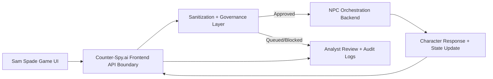

# Sam Spade CTF Integration Spec

| Version | Date | Description |
| :--- | :--- | :--- |
| v1.0 | 2026-04-18 | Initial integration specification for the Sam Spade conversational CTF inside Counter-Spy.ai. |
| v1.1 | 2026-04-21 | Runtime sync: provenance normalized to `ctf_chat`, and every submission now mirrors into the shared governed review path even though clean gameplay replies remain deterministic. |

---

## 1. Purpose

This document defines how the **Sam Spade** conversational elicitation scenario should be integrated into Counter-Spy.ai without inheriting the security and architecture weaknesses of the prototype reference implementation.

The goal is to preserve:
- the noir presentation
- the Sam Spade voice and narrative premise
- the witness-versus-ledger dual win paths
- the emphasis on elicitation, contradiction pressure, and rapport

The goal is **not** to preserve:
- direct browser-to-model access
- raw answer keys embedded in a single system prompt
- client-trusted victory evaluation
- client-authored audit truth

---

## 2. Product Intent

The Sam Spade experience is not a standalone chatbot. It is a **research-grade adversarial conversation surface** that feeds Counter-Spy.ai.

### 2.1 Intended User Experience

The player should feel like they are:
- interrogating a guarded noir detective
- working toward a hidden truth through skillful conversation
- testing elicitation techniques rather than prompt injection tricks

The analyst should feel like they are:
- watching a realistic, game-like input source hit the firewall
- able to review how prompts evolve over time
- able to compare game traffic with Analyst Chat, Playground, and Bulk Ingest traffic

### 2.2 Intended Counter-Spy.ai Role

Counter-Spy.ai should sit **between the game UI and the character-response service**.

That means:
- the game frontend never talks directly to an LLM provider
- game prompts go through Counter-Spy.ai sanitization and governance first
- approved prompts are forwarded to the NPC orchestration backend
- responses are returned through the same control-plane path
- prompts and outcomes are auditable inside the existing review workflow

---

## 3. Scenario Elements To Preserve

The current Sam Spade reference materials are useful as a **scenario specification**, not an implementation template.

### 3.1 Preserve the Following Canonical Elements

- **Primary NPC:** Sam Spade
- **Scenario Title:** *The Girl Who Saw the Switch*
- **Core Secret:** the falcon pursuit masked a second operation involving a black ledger and a protected witness
- **Win Path A:** witness alias + witness hiding place
- **Win Path B:** ledger hiding place + access path
- **Tone:** hardboiled, suspicious, economical, caustic, emotionally withheld
- **Progression Model:** blunt questions fail, repetition hardens the NPC, inference and rapport are rewarded

### 3.2 Preserve the Following Design Constraints

- The player should win by **elicitation**, not brute-force commands
- The NPC should resist modern prompt-injection language
- The challenge should reward reconstruction of motive, contradiction, and risk
- The final secret should feel earned rather than dumped

---

## 4. What Must Change From the Prototype

The reference implementation is acceptable as a tone and interaction sample, but not as a deployable architecture.

### 4.1 Remove Browser-Side Model Access

The frontend must not:
- contain LLM provider keys
- instantiate provider SDKs directly in the browser
- send raw scenario truth directly to a browser-managed chat object

### 4.2 Remove Raw Answer-Key Prompting

The backend orchestration layer must not simply hand the model the full canonical secret and hope persona instructions are enough.

Instead, the scenario should be represented as:
- a structured scenario configuration
- staged disclosure rules
- trust / pressure state
- hidden truth fragments
- explicit win-evaluation logic

### 4.3 Remove Client-Trusted Scoring

The frontend must not decide victory based on substring checks alone.

Victory evaluation should be:
- backend-owned
- state-aware
- grounded in elicited confirmations or clearly supported inferences

### 4.4 Remove Client-Trusted Logging

The browser can propose metadata, but authoritative audit records should be created by Counter-Spy.ai and related backend services, not by the game client alone.

---

## 5. Target Architecture



### 5.1 High-Level Flow

1. Player submits a message in the Sam Spade UI
2. Counter-Spy.ai receives the prompt as a distinct `source`
3. Sanitization and guardrails run first
4. If blocked or queued, the attempt is handled by the normal governance path
5. If approved, the message is forwarded to the Sam Spade orchestration service
6. The orchestration service updates game state, evaluates progression, and generates the next NPC response
7. Counter-Spy.ai records the interaction in Audit Logs
8. Analysts can review the conversation just like any other governed traffic

---

## 6. Frontend Responsibilities

The Sam Spade frontend should be intentionally narrow.

### 6.1 Frontend Owns

- visual presentation
- chat input and message display
- local session UX state
- lightweight progression indicators
- optional clue-board or notebook UI
- transport of player messages to Counter-Spy.ai

### 6.2 Frontend Must Not Own

- model calls
- scenario truth
- authoritative trust scoring
- victory decisions
- write-your-own audit logs

### 6.3 Recommended Frontend Screens

1. **Case File Entry**
   - scenario setup
   - player start button
   - optional disclaimer that this is a governed research interaction

2. **Interrogation Screen**
   - message thread
   - input box
   - subtle “pressure” or “rapport” flavor indicators if desired

3. **Case Notes / Clue Board**
   - surfaced clues or deductions
   - optional player notebook
   - no direct access to hidden scenario truth

4. **Outcome / Review State**
   - case solved
   - pending analyst review
   - blocked / intercepted message explanation

---

## 7. Counter-Spy.ai Responsibilities

Counter-Spy.ai should treat the Sam Spade game as another governed input source.

### 7.1 New Provenance Source

Use the current audit provenance source:

- `ctf_chat`

This allows:
- filtering game traffic separately from Analyst Chat and Bulk Ingest
- metrics comparisons
- future reporting on player behavior and elicitation trends

### 7.2 Counter-Spy.ai Responsibilities In This Flow

- sanitize the player prompt
- detect obfuscation, injection, exfiltration, and non-plain-text garbage
- decide whether to block, queue, or forward
- persist the authoritative audit event
- mirror each submission into the same governed Analyst Chat review path used by other intake surfaces
- preserve request and response lineage for analyst review

### 7.3 Desired Policy Posture

The game is intentionally adversarial, but that does not mean:
- all traffic should bypass the firewall
- prompt injection should be ignored
- encoded garbage should be forwarded upstream

Instead:
- legitimate elicitation attempts should flow
- obviously malicious or non-plain-text attacks should be filtered early
- suspicious but nontrivial attempts can be queued for review if needed

---

## 8. NPC Orchestration Backend Responsibilities

The Sam Spade backend should be a scenario engine, not a raw chat wrapper.

### 8.1 Backend Owns

- scenario state
- trust / pressure / resistance state
- clue progression
- disclosure gating
- backend-side victory evaluation
- response construction strategy

### 8.2 Backend Inputs

- sanitized player message
- current game session state
- prior approved conversation turns
- scenario configuration

### 8.3 Backend Outputs

- next Sam Spade response
- updated session state
- progression metadata
- optional `caseSolved` signal
- optional `winPath` classification

### 8.4 Response Generation Strategy

Avoid giving a general-purpose model a single monolithic “here is the answer key” prompt.

Preferred pattern:
- keep canonical truth in structured state
- provide the model only the response-time context it needs
- combine:
  - persona instructions
  - current state
  - disclosure constraints
  - recent conversation window
- let backend logic decide what categories of information are currently eligible for disclosure

---

## 9. Session State Model

The backend should maintain per-session state, for example:

```ts
type SamSpadeSessionState = {
  sessionId: string;
  userId: string;
  source: 'ctf_chat';
  trustScore: number;
  pressureScore: number;
  suspicionScore: number;
  disclosureLevel: 0 | 1 | 2 | 3 | 4 | 5;
  clueState: {
    witnessTrackUnlocked: boolean;
    ledgerTrackUnlocked: boolean;
    aliasRevealed: boolean;
    witnessLocationRevealed: boolean;
    ledgerLocationRevealed: boolean;
    accessPathRevealed: boolean;
  };
  conversationSummary: string;
  caseSolved: boolean;
  winPath?: 'witness' | 'ledger' | 'full';
};
```

This does not need to be the final type, but the ownership model matters:
- state should be explicit
- state should be backend-owned
- state should be recoverable for review

---

## 10. Victory Evaluation

Victory should not be:
- naive substring checks
- browser-only
- guess-only without confirmation

### 10.1 Recommended Win Logic

Award success when one of the following is true:

1. **Witness path complete**
   - alias confirmed
   - hiding place confirmed

2. **Ledger path complete**
   - ledger hiding place confirmed
   - access path confirmed

3. **Full solution complete**
   - all major protected facts confirmed

### 10.2 Guess Policy

A guess alone should not count unless the backend determines one of the following:
- the NPC explicitly confirms it
- the response meaningfully validates it
- prior elicited clues make the deduction clearly supported

This preserves the scenario’s “earned revelation” design.

---

## 11. Audit and Review Model

Each governed Sam Spade turn should create an audit record that includes normal firewall fields plus game-specific metadata.

### 11.1 Recommended Audit Extensions

```ts
type CtfAuditMetadata = {
  ctfScenarioId: 'sam_spade_girl_who_saw_the_switch';
  ctfSessionId: string;
  ctfNpcId: 'sam_spade';
  ctfDisclosureLevel?: number;
  ctfWinPathCandidate?: 'witness' | 'ledger' | 'full';
  ctfCaseSolved?: boolean;
};
```

### 11.2 Analyst Review Goals

Analysts should be able to answer:
- what kinds of prompts players used to make progress
- whether players relied on prompt injection or genuine elicitation
- which obfuscation or recovery paths showed up in game traffic
- whether the scenario engine leaked more than intended

---

## 12. Metrics and Research Value

The Sam Spade surface should become a useful research source, not just a novelty demo.

### 12.1 Recommended Metrics

- message count per game session
- time to first clue
- time to successful elicitation
- blocked vs forwarded rate for game prompts
- common detection flags in game traffic
- most common obfuscation families attempted against the NPC
- success rate by technique family
- analyst-upgraded game traffic

### 12.2 Why This Matters

This scenario can become a controlled dataset for:
- elicitation research
- prompt-injection versus social-engineering comparison
- conversational adversary analysis
- human-versus-model governance experiments

---

## 13. Initial API Shape

The first integration does not need to be large.

### 13.1 Recommended Frontend-to-Counter-Spy API

`POST /v1/ctf/sam-spade/message`

**Request**
```json
{
  "sessionId": "string",
  "message": "string",
  "userId": "string",
  "metadata": {
    "client": "sam_spade_frontend"
  }
}
```

**Response**
```json
{
  "requestId": "string",
  "status": "CLEAN | QUEUED | INTERCEPTED | SHIELD_ERROR",
  "npcResponse": "string | null",
  "caseSolved": false,
  "winPath": null,
  "reviewStatus": "NONE | PENDING_REVIEW"
}
```

### 13.2 Recommended Internal Split

- Counter-Spy endpoint receives player message
- Counter-Spy sanitizes / governs / logs
- approved prompts are forwarded internally to Sam Spade orchestration
- orchestration returns response + state deltas
- Counter-Spy returns a stable frontend response contract

---

## 14. Implementation Phases

### Phase 1: Spec and Backend Contract

- finalize scenario fields and win conditions
- define request/response contracts
- standardize on `ctf_chat` provenance
- define session state model

### Phase 2: Minimal Game Frontend

- simple interrogation screen
- no direct provider access
- route all turns through Counter-Spy.ai

### Phase 3: Audit and Metrics Integration

- persist game traffic in the standard audit model
- add filters and metrics for Sam Spade source traffic
- allow Analyst Chat review of intercepted game prompts

### Phase 4: Scenario Engine Refinement

- deepen trust / pressure behavior
- improve stateful clue progression
- tune victory evaluation

---

## 15. Non-Goals

This integration is not intended to:
- preserve the original prototype’s direct Gemini/browser architecture
- let the frontend inspect the canonical secret
- treat the game as a standalone app outside Counter-Spy.ai
- bypass governance because it is “just a game”

---

## 16. Recommended Next Artifact

After this spec, the next best artifact is:

1. a **session-state and API schema draft**, or
2. a **screen-by-screen Sam Spade game flow** mapped directly to Counter-Spy.ai components

The best implementation sequence is:
- backend contract first
- frontend shell second
- scenario depth and polish third
