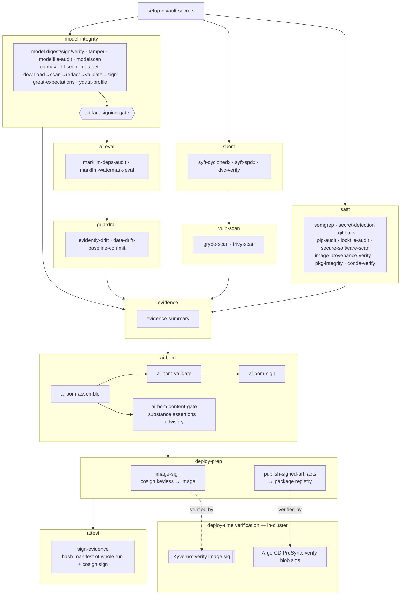

# MLSECDEVOPS GitLab Pipeline — Software Bill of Materials

**Pipeline:** `.gitlab-ci.yml` (repo root)  
**Date:** 2026-06-08  
**Last updated:** 2026-06-19  
**Scope:** All tools, images, and packages installed or invoked by the pipeline at runtime. This is the pipeline's own dependency surface — not the project code it scans.

> **Out of scope — offline ingest tooling.** `scripts/parquet_to_jsonl.py` converts a Hugging Face Parquet split to schema-valid JSONL and needs `pyarrow`, but it runs **once, offline, before commit** — it is never installed or invoked by any CI job. `pyarrow` is therefore deliberately absent from the package tables below; the CI dataset chain operates only on the committed JSONL.

> **Pin status key**  
> ✅ Pinned — explicit version locked in the CI file  
> ⚠️ Unpinned — installs latest at job runtime; pin before production use

---

## Process Flow

The pipeline is a DAG across ten stages. `model-integrity` converges on `artifact-signing-gate` (no AI eval runs until model + dataset integrity is proven); `ai-bom` consolidates everything into one signed CycloneDX 1.6 AI BOM; `deploy-prep` signs the workload image and publishes the signed artifacts, closing the sign→verify loop that **Kyverno** (image) and the **Argo CD PreSync hook** (model/dataset/AI-BOM) enforce in-cluster (dashed edges). See `../README.md` → *Pipeline Walkthrough* for the per-job detail.

---

## Container Images

> **All images below are pinned by immutable `@sha256:` digest** (multi-arch index
> digest) via the `IMAGE_*` variables at the top of `.gitlab-ci.yml`, captured
> 2026-06-20. The `:tag` is retained for readability but the digest is what Docker
> resolves, so a repointed upstream tag cannot change the bytes CI runs. The base
> `python:3.11-slim` / `python:3.10-slim` and the GitLab secrets image (previously
> hardcoded inline per-job) are now centralized as `IMAGE_PYTHON_311` /
> `IMAGE_PYTHON_310` / `IMAGE_SECRETS` and digest-pinned too. To roll an image:
> `docker buildx imagetools inspect <name>:<tag> --format '{{.Manifest.Digest}}'`
> and update the `@sha256` in the variable. *Provenance* (who published these bytes)
> is a separate control — see `image-provenance-verify` and the coverage matrix below.

| Image | Tag | Used by | Pin status |
| --- | --- | --- | --- |
| `python` | `3.11-slim` | All jobs (default, via `IMAGE_PYTHON_311`) | ✅ Digest-pinned |
| `python` | `3.10-slim` | `markllm-watermark-eval`, `markllm-deps-audit` (via `IMAGE_PYTHON_310`) | ✅ Digest-pinned |
| `registry.gitlab.com/security-products/secrets` | `4` | `secret-detection` (via `IMAGE_SECRETS`) | ✅ Digest-pinned |
| `gitleaks/gitleaks` | `v8.30.1` | `gitleaks-scan` | ✅ Pinned via `IMAGE_GITLEAKS` (matches the `GITLEAKS_VERSION` binary; distinct from the checksum-pinned `gitleaks` binary in `dataset-redact`) |
| `clamav/clamav` | `1.4` | `clamav-scan` | ✅ Pinned via `IMAGE_CLAMAV` (patch-floating line, like `python:3.11-slim`; append a digest for full reproducibility. Also `apt-get`-installed in `hf-artifact-scan`, `dataset-scan`) |
| `semgrep/semgrep` | `1.165.0` | `semgrep-sast` | ✅ Pinned (`IMAGE_SEMGREP`; the job runs in this image — no `pip install semgrep`) |
| `continuumio/miniconda3` | `26.3.2` | `conda-pkg-verify` | ✅ Pinned |
| `anchore/syft` | `v1.45.1-debug` | `syft-cyclonedx`, `syft-spdx` | ✅ Pinned (`-debug` variant ships a shell for the wrapper scripts) |
| `anchore/grype` | `v0.114.0-debug` | `grype-scan` | ✅ Pinned (`-debug` variant ships a shell) |
| `aquasec/trivy` | `0.71.1` | `trivy-scan` | ✅ Pinned (no `v` prefix; keep in sync with the trivy-db schema) |
| `cyclonedx/cyclonedx-cli` | `0.32.0` | `ai-bom-validate`, `ai-bom-sign` | ✅ Pinned |

---

## Binary Tools (installed at job runtime)

| Tool | Version | Source | Used by | Pin status |
| --- | --- | --- | --- | --- |
| `cosign` | `v2.4.1` | `github.com/sigstore/cosign/releases` | `model-signing-install`, `dataset-sign`, `ai-bom-sign`, `sign-evidence`, `image-sign` (5 install sites) | ✅ Pinned + checksum verified |
| `gitleaks` | `8.30.1` | `github.com/gitleaks/gitleaks/releases` | `dataset-redact` | ✅ Pinned + checksum verified |

---

## Python Packages (pip install)

Most packages below are installed from **hash-pinned group locks** (`ci/requirements-ci.txt`, `ci/requirements-ci-dataquality.txt`) via `pip install --require-hashes`, so a tampered or substituted wheel fails the install. A few tools are version-pinned via CI variables (e.g. `MODEL_SIGNING_VERSION`, `SIGSTORE_PY_VERSION`), and the markllm group is version-pinned in `ci/requirements-ci-markllm.in`. The per-row **Pin status** column reflects each package's actual state; anything marked ⚠️ Unpinned still resolves to the latest version at runtime.

| Package | Extras | Used by | Pin status | Notes |
| --- | --- | --- | --- | --- |
| `model-signing` | — | `model-signing-install`, `model-digest`, `model-sign`, `signature-verification` | ⚠️ Unpinned | Core signing/verification library; pin to avoid breaking API changes (`sign-evidence` no longer installs it — it signs with cosign only) |
| `sigstore` | — | `model-signing-install`, `model-sign`, `signature-verification` | ⚠️ Unpinned | Sigstore Python SDK; used for keyless signing via Fulcio/Rekor |
| `hvac` | — | `vault-secrets`, `tamper-verification` | ⚠️ Unpinned | HashiCorp Vault Python client |
| `pip-audit` | — | `pip-audit` | ⚠️ Unpinned | Audits `requirements.txt` against OSV and advisory DBs |
| `pip-tools` | — | `pkg-integrity` | ⚠️ Unpinned | `pip-compile` for generating hashed lockfiles |
| `modelscan` | — | `modelscan`, `hf-artifact-scan` | ⚠️ Unpinned | Detects malicious serialization payloads in model files |
| `huggingface_hub` | — | `hf-artifact-scan` | ⚠️ Unpinned | Downloads HuggingFace model snapshots for scanning |
| `markllm` | `==0.1.5` | `markllm-watermark-eval` | ✅ Pinned (`MARKLLM_VERSION`) | LLM watermark detection |
| `torch` | `==2.12.0+cpu` | `markllm-watermark-eval` | ✅ Pinned, CPU-only wheel (`TORCH_VERSION`) | PyTorch — installed from the PyTorch CPU index (no `nvidia-*` CUDA deps; ~200 MB vs ~2 GB) to bound runner disk |
| `transformers` | `==4.57.6` | `markllm-watermark-eval` | ✅ Pinned (`TRANSFORMERS_VERSION`) | Hugging Face Transformers (required by markllm) |
| `jsonschema` | — | `eval-dataset-validate` | ⚠️ Unpinned | Draft-07 validation of eval dataset records against `evals/eval-dataset.schema.json` |
| `presidio-analyzer` | — | `dataset-redact` | ⚠️ Unpinned | Microsoft Presidio PII detection (pulls in `spacy`) |
| `presidio-anonymizer` | — | `dataset-redact` | ⚠️ Unpinned | Presidio PII redaction/anonymization |
| `spacy` (`en_core_web_sm`) | — | `dataset-redact` | ⚠️ Unpinned | NLP model for Presidio; fetched via `python -m spacy download` |
| `jinja2` | — | `evidence-summary` | ⚠️ Unpinned | Template rendering for evidence summary |
| `great-expectations` | — | `great-expectations-validate` | ⚠️ Unpinned | GX Core 1.x content-quality checkpoint (null rates, ranges, uniqueness) + Data Docs |
| `evidently` | — | `evidently-drift` | ⚠️ Unpinned | Data/feature drift (DataDriftPreset/PSI) + LLM TextEvals over the dataset |
| `ydata-profiling` | — | `ydata-profile` | ⚠️ Unpinned | Advisory dataset profile; pins narrow numpy/pandas/matplotlib ranges |
| `dvc` | `[all]` | `dvc-verify` | ⚠️ Unpinned | Data/model version lineage; verifies workspace vs pinned versions |
| `requests` | — | `secure-software-scan`, `write_operational_metrics` | ⚠️ Unpinned | HTTP client for the ReversingLabs Spectra Assure Community REST API and the GitLab API metrics block |
| `pandas` | — | `great-expectations-validate`, `evidently-drift`, `ydata-profile` | ⚠️ Unpinned | Dataset loading for the data-quality jobs |
| `pip` / `setuptools` / `wheel` | — | All Python jobs (before_script) | ⚠️ Unpinned | Upgraded to latest in every job before_script |

---

## Supply-Chain Control Coverage by Artifact Class

The pin-status tables above answer *"is it pinned?"* — this matrix answers the
harder question: *"for every third-party thing the pipeline pulls, what actually
vets it?"* It crosses each **artifact class** against the four supply-chain
controls, so a gap reads as a gap instead of being implied-covered by a pin.

> **Why the reputation/malware gate (`secure-software-scan`) is PyPI-scoped — by
> design, not omission.** Its mechanism is the ReversingLabs Spectra Assure
> **Community `/find/packages` purl search** — a *package-catalogue* reputation
> lookup. It reaches package **ecosystems** (PyPI here; npm/gem/nuget/… in
> principle), but it cannot reputation-rate the pipeline's other pulled classes —
> container images, GitHub-release binaries, and model weights are different
> artifact types that the free purl catalogue does not index. Those classes are
> therefore covered by *different* controls (checksum verification, model
> scanning/signing, image CVE-scan + pinning), tabulated below. Within this
> pipeline the only application **package ecosystem** is PyPI — so "scan every
> package" and "scan PyPI" coincide for this pipeline.

| Artifact class | Examples | Version-pinned | CVE-scanned | Malware/reputation-gated | Signature / checksum verified | Controlling job(s) |
| --- | --- | --- | --- | --- | --- | --- |
| **PyPI packages** (full stack) | torch, transformers, presidio, evidently, model-signing, … | ✅ group locks (`requirements-ci*.txt`); ⚠️ root manifest is 3 deps | ✅ `pip-audit` + `lockfile-audit` + per-job `.audit-env` + `markllm-deps-audit` | ✅ **`secure-software-scan`** — full accessed-library surface (this fix) | ⚠️ hashes available via `pkg-integrity --require-hashes`; not yet wired pipeline-wide | `secure-software-scan`, `lockfile-audit`, `pip-audit`, `markllm-deps-audit` |
| **Container images — tools / base** | semgrep, syft, grype, trivy, gitleaks, clamav, cyclonedx-cli, miniconda, python, gitlab-secrets | ✅ **digest-pinned** (`@sha256` via `IMAGE_*`) | ❌ the tool images themselves are not scanned (trivy/grype scan the *workload* image + filesystem, not the scanner images) | ❌ not coverable via the Community purl API | ⚠️ **partial** — `image-provenance-verify` cosign-verifies the images with a documented keyless identity (**trivy**); the rest are digest-pinned only (logged explicitly) | `image-provenance-verify` |
| **Container image — workload** | `ghcr.io/…/gaips-rag-app` (built by the separate app pipeline) | ✅ by digest at deploy | ✅ `trivy-scan` (image), `grype-scan` | ❌ N/A | ✅ `image-sign` (cosign keyless) → **Kyverno** verifies at admission | `image-sign`, `trivy-scan`, `grype-scan` |
| **GitHub-release binaries** | `cosign` v2.4.1, `gitleaks` 8.30.1 | ✅ version-pinned | ❌ | ❌ not in the purl catalogue | ✅ **`sha256sum --check --strict`** against the published checksums file before install | `model-signing-install`, `dataset-sign`, `ai-bom-sign`, `sign-evidence`, `image-sign` (cosign); `dataset-redact` (gitleaks) |
| **Model weights** | Qwen GGUF fixture; markllm transformers model | ✅ SHA-pinned (`*_EXPECTED_SHA256`) | n/a (not CVE-bearing) | ✅ **malware-scanned**: `modelscan` + `modelaudit-scan` + `clamav-scan` (≠ reputation, but the equivalent control for weights) | ✅ `model-sign` (cosign keyless) + `signature-verification` | `modelscan`, `modelaudit-scan`, `clamav-scan`, `model-sign`, `signature-verification` |
| **HF dataset** | Lakera `gandalf_ignore_instructions` (112 rows) | ✅ `DATASET_EXPECTED_SHA256` on raw pre-redaction bytes | n/a | ✅ secret + PII scan (`dataset-scan`, `redact_dataset.py`) | ✅ `dataset-sign` (cosign over redacted bytes) | `dataset-download`, `dataset-scan`, `dataset-redact`, `dataset-sign` |
| **apt / OS packages** | curl, git, ca-certificates, clamav | ❌ unpinned (distro repo `latest`) | ❌ not individually scanned | ❌ | ⚠️ implicit (distro signing on official base images) | (base-image trust) |

**Residual gaps (explicit):**
1. **Tool/base image provenance is verified where a signature exists; most images publish none.** ✅ *Integrity* is closed — every image is digest-pinned (`@sha256` via `IMAGE_*`), so a repointed upstream tag can't change the bytes. *Provenance* (`image-provenance-verify`) covers **trivy** — the **only** image in this set that publishes a discoverable cosign signature. This was determined empirically (2026-06-20) by querying each registry's **OCI referrers API** for a sigstore bundle (`application/vnd.dev.sigstore.bundle.v0.3+json`): trivy returns one; **anchore `syft`/`grype` (both the `-debug` and plain variants, on Docker Hub **and** ghcr.io), semgrep, miniconda, cyclonedx-cli, clamav, gitleaks, and the `python` base images all return empty / no referrers** — they are not cosign-signed by their publishers, so there is nothing to verify and they remain digest-pinned only. (An earlier note speculated anchore signed its ghcr.io images; the referrers probe disproved this — there is no signature on either registry.)
2. **apt/OS packages are unpinned** and pulled from distro `latest`. Low risk (standard tooling from official base images), but not reproducible and not vetted beyond distro signing.
3. **GitHub-release binaries are checksum-verified, not provenance-verified.** A checksum proves the bytes match the published file; it does not prove the release's build provenance (SLSA / `cosign verify-blob` against the project's identity). Adequate for now; noted for completeness.

These are **not** in scope for `secure-software-scan` (the purl catalogue can't reach those artifact classes); they belong to image digest-pinning (✅ done) / `image-provenance-verify` / base-image hardening. This section exists so that distinction is recorded rather than assumed.

---

## Vault Integration Dependencies

| Component | Version | Notes |
| --- | --- | --- |
| HashiCorp Vault | ≥ 1.12 | Required for JWT auth backend and KV v2. Version set by your deployment. **HCP Vault Dedicated** (managed Vault Enterprise) is supported: set `VAULT_NAMESPACE` (`admin` or a child) on the `vault-secrets`/`tamper-verification` jobs — see `deployment/vault/sample-secret-map.md`. |
| Vault namespace | — | Blank for OSS Vault; `admin` (or `admin/gaips`) for HCP Vault / Enterprise. Wired via the `VAULT_NAMESPACE` CI variable (hvac `namespace=`) and Terraform `var.vault_namespace` (provider `namespace`). Secret paths are unchanged — they resolve inside the namespace. |
| Vault Terraform provider (`hashicorp/vault`) | `~> 4.0` | Pinned in `deployment/vault/terraform/main.tf`; provider `namespace` set from `var.vault_namespace`. |
| Terraform | ≥ 1.6 | Required by `deployment/vault/terraform/main.tf` |
| GitLab `id_tokens` | GitLab ≥ 15.7 | Required for OIDC JWT issuance (`VAULT_ID_TOKEN`, `SIGSTORE_ID_TOKEN`). Falls back to `CI_JOB_JWT_V2` on older instances (deprecated in GitLab 16.x). HCP Vault must be able to reach the GitLab JWKS endpoint to validate these tokens. |

---

## Remediation Status

| Risk | Status | Notes |
| --- | --- | --- |
| No upstream reputation/malware gate on OSS dependencies (pip-audit/grype/trivy catch *known CVEs*, not *malicious packages* — typosquats, account-takeover injections, removed/tampered releases) | ✅ Added | New `secure-software-scan` (sast stage, next to `pip-audit`; `scripts/secure_software_scan.py`) polls the ReversingLabs Spectra Assure **Community** catalogue across the **full accessed-library surface** — the `ci/requirements-ci*.txt` group locks plus the markllm group's `torch`/`transformers`/`markllm` pins (deduped purls, batched 5/request), not the 3-package root manifest — and reads each pinned version's `assessments.malware`/`assessments.tampering` verdict + `incidents`. Enforcement switch `RL_FAIL_ON`: blank = report-only; `malware,tampering` = gate. Skips cleanly when `RL_TOKEN` is unset. **Remaining action:** create a Community PAT, set `RL_TOKEN` (masked+protected), then flip `RL_FAIL_ON` to `malware,tampering` to enforce. |
| `cosign` binary downloaded with no checksum verification | ✅ Fixed | All five install sites (`model-signing-install`, `dataset-sign`, `ai-bom-sign`, `sign-evidence`, `image-sign`) download `cosign_checksums.txt` and verify via `sha256sum --check --strict` before installing |
| `torch` + `transformers` unaudited | ✅ Fixed | New `markllm-deps-audit` job runs `pip-audit` against `torch`, `transformers`, and `markllm` before `markllm-watermark-eval` |
| Current CI blocked by historic secret fixtures | ✅ Scoped | GitLab native `secret-detection` remains a hard gate, but runs against the current HEAD checkout (`GIT_DEPTH: 1`, `SECRET_DETECTION_LOG_OPTIONS="--max-count=1"`). Use one-off historic scans/history cleanup for old fixtures instead of blocking every current pipeline. |
| Advisory eval failures discarded evidence | ✅ Fixed | `markllm-watermark-eval` uploads artifacts with `when: always`, and writes a minimal failure JSON when the tool exits before producing its report. |
| Superseded pipelines consuming runner minutes | ✅ Mitigated | Pipeline jobs are `interruptible: true`. Enable GitLab project auto-cancel redundant pipelines so newer pushes cancel obsolete jobs during debugging. |
| Container images use `:latest` | ✅ Fixed | All scanner images pinned via `IMAGE_*` variables at top of CI file: `semgrep/semgrep:1.165.0`, `continuumio/miniconda3:26.3.2`, `anchore/syft:v1.45.1-debug`, `anchore/grype:v0.114.0-debug`, `aquasec/trivy:0.71.1`, `cyclonedx/cyclonedx-cli:0.32.0`, **`gitleaks/gitleaks:v8.30.1`** (`IMAGE_GITLEAKS`), and **`clamav/clamav:1.4`** (`IMAGE_CLAMAV`). No job uses `:latest` anymore. `registry.gitlab.com/security-products/secrets:4` is pinned at a major tag; `python:3.11-slim`/`python:3.10-slim` remain unpinned at minor version. **Remaining hardening:** append `@sha256:…` digests for byte-exact reproducibility. |
| Container images tag-pinned but not digest-pinned (mutable tags) | ✅ Fixed (2026-06-20) | All `IMAGE_*` references now pin an immutable `@sha256:` index digest (tag kept for readability). Base `python:3.11-slim`/`python:3.10-slim` and the GitLab secrets image were centralized from inline per-job use into `IMAGE_PYTHON_311`/`IMAGE_PYTHON_310`/`IMAGE_SECRETS` and digest-pinned. See *Container Images* note above for the re-resolve command. |
| Pulled tool/base images not provenance-verified (no check they came from the genuine publisher) | ✅ Done as far as upstreams allow (2026-06-20) | New advisory `image-provenance-verify` (sast) installs pinned+checksum-verified cosign and `cosign verify`s the images with a publisher-documented keyless identity — **trivy** (`https://github.com/aquasecurity/trivy/.github/workflows/.+`, GitHub Actions OIDC). A referrers-API probe of every image (see residual gap #1) established that trivy is the **only** one with a discoverable cosign signature; anchore syft/grype, semgrep, miniconda, cyclonedx-cli, clamav, gitleaks, and python publish none, so they are logged as digest-pinned-only (no silent gaps). Teeth-last via `IMAGE_VERIFY_REQUIRE`. **cosign version:** the job installs cosign **v3** (`COSIGN_VERIFY_VERSION`), not the signing jobs' 2.4.1 — trivy's signature is the OCI-referrers `sigstore.bundle.v0.3` format with no `.sig` tag, which cosign 2.4.1 reports as "no signatures found" (confirmed locally); cosign v3.1.1 verifies it with the plain command (exit 0, 2 signatures). **Remaining:** confirm green on a CI run, then flip `IMAGE_VERIFY_REQUIRE=true`. (No anchore→ghcr switch — the ghcr.io images are unsigned too.) |
| All pip packages unpinned | ✅ Structured | `ci/requirements-ci.in` created listing all pipeline packages. **Remaining action:** run `pip-compile --generate-hashes requirements-ci.in` on a Python 3.11-slim Linux container to produce `requirements-ci.txt`, commit it, then switch each CI job from inline `pip install` to `pip install -r ci/requirements-ci.txt` |
| Verify-at-deploy loop half-wired (image unsigned; PreSync hook had nothing to fetch) | ✅ Fixed | `deploy-prep` stage added: `image-sign` (Cosign keyless → matches the Kyverno policy identity) and `publish-signed-artifacts` (signed AI-BOM + dataset → Generic Package Registry, the path the Argo CD PreSync hook fetches). PreSync hook corrected to verify the model with `model_signing` (not `cosign verify-blob`). **Remaining action:** set `IMAGE_REF`, point the PreSync `ARTIFACT_BASE_URL` at the package path, and flip Kyverno to `Enforce` once a signed digest is confirmed. |
| AI-BOM recorded known vulns only as property counts (no structured `vulnerabilities[]`) | ✅ Fixed (#29) | `build_ai_bom.py` emits a CycloneDX `vulnerabilities[]` from pip-audit (`markllm-deps-audit` + per-job `pip-audit-*`), grype, and trivy, deduped, with `affects[].ref` → component `bom-ref`s. Auditors ingest structured vulns, not just counts. |
| AI-BOM fused two disjoint dependency universes into one count + hollow `modelCard` | ✅ Fixed (#30) | Software count split into `bom.counts.software.pipeline` vs `…software.markllm` with `gaips:source` labels; `modelCard` populated from `markllm-results.json`. **Remaining:** the pipeline-side closure is only as deep as `syft-cyclonedx` (transitive-shallow) — tracked as #35. |
| AI-BOM validation checked form, not substance | ✅ Fixed (#31, advisory) | New `ai-bom-content-gate` (`assert_ai_bom_content.py`, `python:3.11-slim`) asserts audit-found-vulns ⇒ non-empty `vulnerabilities[]`, models signed + verified. Advisory (`allow_failure: true`); `--enforce` for teeth once green. |
| "Signed ≠ verified" + absolute artifact paths | ✅ Fixed (#32) | `model-digest` records repo-relative paths (clears #40-F4/#41-F5); `build_ai_bom` + `sign-evidence` emit `model.verified`/`verified_reason` from `signature-verification` #19 (honestly `false`/deferred until #19 on a protected ref). |
| Evidence-summary gate checked file presence, not verdicts | ✅ Fixed (#33, WARN-first) | `write_ci_evidence_summary.py` reads 3-state verdicts (pass/fail/inert); missing-required still hard-fails, present-but-failing warns by default and blocks under `--enforce-verdicts`. |
| AI-BOM `data` components carried no provenance/license (asymmetric with models, which fold in full HF metadata) | ✅ Fixed | `build_ai_bom.py` now reads the reviewed `evals/dataset-baseline.json` (via `--dataset-baseline`) and stamps a CycloneDX `licenses` entry (SPDX `MIT`) plus `gaips:dataset.source/.revision/.split/.citation` onto the dataset component. Paired with `evals/dataset-baseline.json` as the single source of truth for `DATASET_EXPECTED_SHA256`. |
| Dataset-tamper detection required a package registry (fixture mode applied no integrity pin) | ✅ Fixed | `dataset-download` now verifies the committed fixture against `DATASET_EXPECTED_SHA256` in fixture mode too (configurable via `DATASET_FIXTURE_FILE`). The check is on raw pre-redaction bytes, so it is deterministic. Default fixture is the Lakera `gandalf_ignore_instructions` test split (112 records, MIT). |
| Runner disk exhaustion (`[Errno 28] No space left on device`) on `saas-linux-small` | ✅ Mitigated | Two compounding causes: (1) unpinned heavy deps (`modelaudit[all]`, the torch/tensorflow/CUDA MarkLLM stack) grew over time past the small runner's ephemeral disk; (2) a bloated shared pip cache (`key: pip-<ref>`, `pull-push`) accumulated those wheels and every job re-restored it. **Fix:** bumped the cache key to `pip-v2-<ref>` (abandons the bloat); `cache: {}` on the bloaters (`markllm-watermark-eval`, `modelaudit-scan`, `lockfile-audit`) so they no longer restore/save it; moved `modelaudit-scan` and `markllm-watermark-eval` to **`saas-linux-medium-amd64`** (disk headroom; ~2× minutes for those two jobs). **Durable action (still open):** pin the dependency set (`requirements-ci.txt`) so dep growth can't silently re-trigger this. |
| Presidio over-redaction corrupted record identifiers (`id` mis-tagged `DATE_TIME`/`PERSON`) | ✅ Fixed | `redact_dataset.py` now leaves structural eval-dataset contract keys un-redacted (`--skip-keys`, default `id,case_id,category`) — they are identifiers/labels, not free-text PII. Previously redaction collapsed 112 unique ids to 89, breaking great-expectations id-uniqueness and record identity in the signed dataset + AI-BOM. Free-text fields (`prompt`/`question`/`expected`) are still fully redacted; the report records `skipped_keys`. |
