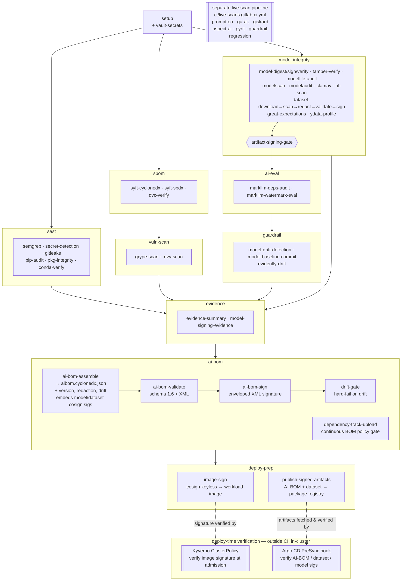

# GAIPS Materials

This directory contains the concrete starter artifacts and fixtures used by the GAIPS course docs. It is intentionally self-contained so a class can run without production accounts, private credentials, gated models, or undefined instructor assets.

## Directory Map

| Directory | Purpose |
| --- | --- |
| `model-gateway/` | Reference provider wrapper and model-call evidence logging contract. |
| `evals/` | Promptfoo, garak, Giskard, Inspect AI, MarkLLM, and PyRIT lab instructions/config. |
| `evals/markllm.md` | MarkLLM live watermark evaluation lab guidance for CI evidence and model-output provenance review. |
| `evals/model-baseline.json` | Approved model identity (path + sha256) and the CI variables it implies (`MODEL_FIXTURE_*`, MarkLLM stack); imported by the `model-manifest` job as a dotenv manifest and the reviewed source of truth for the model-integrity baseline. |
| `fixtures/` | Static red-team and eval outputs for fixture-mode labs. |
| `guardrails/` | Prompt Guard, Llama Guard 3, Model Armor, and regression fixtures. |
| `mcp/` | Lab-safe Cline MCP configuration. |
| `agent/` | Lab-safe agent fixture for tool permission and HackAgent review. |
| `buttercup/` | Automated vulnerability finding and patch-review fixture. |
| `ci/` | GitLab AI/ML security pipeline requiring project-level scripts, model artifacts, SBOM/vulnerability tooling, model-integrity checks, AI evals, and evidence outputs. See `ci/SBOM.md` for the pipeline's own dependency bill of materials. |
| `hugging-face-hub/` | Hub scanner and repository-settings review fixture. |
| `deployment/` | Kubernetes, Weaviate components, Weaviate `values.yaml` TLS/encryption review, gRPC LoadBalancer, and Vault review fixtures. |
| `model-signing/` | Signed, unsigned, and tampered artifact review fixture. |
| `sagemaker/` | Sanitized Hugging Face Estimator notebook and training-script fixture. |
| `bedrock-knowledge-bases/` | Bedrock Knowledge Bases design-review fixture. |
| `model-customization/` | Completed Lab 12 customization matrix. |
| `scripts/csv_to_jsonl.py` | CSV-to-JSONL converter for training, eval, and ChatML-style message datasets. |
| `scripts/weaviate_ollama_sdk_example.py` | Weaviate Python SDK example that maps a collection to an Ollama-hosted embedding model. |

## Student Copy Pattern

For a standalone lab repository, copy the needed subdirectories into the lab root:

```bash
mkdir -p gaips-labs
cp -R docs/gaips-materials/evals gaips-labs/evals
cp -R docs/gaips-materials/fixtures gaips-labs/fixtures
cp -R docs/gaips-materials/guardrails gaips-labs/guardrails
cp docs/gaips-materials/ci/.gitlab-ci.yml gaips-labs/.gitlab-ci.yml
```

Students should still explain each result. Fixture mode replaces unavailable execution, not analysis.

## CSV To JSONL Dataset Conversion

Use `scripts/csv_to_jsonl.py` when a lab receives a CSV training or eval dataset but the model, eval, or fine-tuning workflow expects JSONL. The script uses only the Python standard library.

Default ChatML-style conversion expects `prompt` and `completion` columns:

```bash
python docs/gaips-materials/scripts/csv_to_jsonl.py \
  --input data/training.csv \
  --output data/training.jsonl \
  --schema chatml
```

Optional developer/system instructions may be supplied with `--system-column system`. For raw row preservation, use `--schema records`. For simple prompt/completion JSONL, use `--schema prompt-completion`.

Before conversion, verify the CSV contains only approved synthetic or sanitized data. After conversion, record row count, schema, source path, output path, and any redaction performed in lab evidence.

## CI Execution Policy

`ci/.gitlab-ci.yml` is a GitLab AI/ML security pipeline. It is intended for a lab repository that contains project-level dependencies, scripts, model artifacts, prompt/eval config, and guardrail baselines. A companion [`ci/live-scans.gitlab-ci.yml`](ci/live-scans.gitlab-ci.yml) holds the endpoint-dependent live evals as a separate pipeline for a project with a model endpoint — see [`ci/live-scans.md`](ci/live-scans.md).

> **Full setup runbook:** [`SETUP.md`](SETUP.md) walks the entire path end to end — provisioning HCP Vault (or self-managed Vault) with Terraform, GitLab CI/CD variables, the first pipeline run, optional integrations (Dependency-Track, HF/dataset scanning, DVC), and deploy-time Kyverno + Argo CD verification.
> **CI/CD variable catalog:** [`ci/CI-VARIABLES.md`](ci/CI-VARIABLES.md) lists every variable the pipeline reads, its source (you / Vault / GitLab), masking, default, and what it gates. Terraform inputs: [`deployment/vault/terraform/terraform.tfvars.example`](deployment/vault/terraform/terraform.tfvars.example).

The pipeline stages are `setup`, `sast`, `sbom`, `vuln-scan`, `model-integrity`, `ai-eval`, `guardrail`, `evidence`, `ai-bom`, and `deploy-prep`. It produces Git version provenance, Semgrep, `pip-audit`, package-integrity, conda verification, Syft CycloneDX/SPDX, Grype, Trivy, ModelScan, ModelAudit, Hugging Face artifact scan, model digest/signature/tamper, dataset redaction (secrets + PII), eval-dataset schema validation, MarkLLM live watermark evaluation, model-drift detection, evidence, a consolidated CycloneDX 1.6 AI BOM artifact (also pushed to Dependency-Track), a Cosign-signed workload image, and a published signed-artifact bundle for deploy-time verification. It performs **no inference** and needs no model endpoint.

> **Live evals run in a separate pipeline.** The endpoint-dependent evals — `promptfoo-eval`, `garak-scan`, `giskard-scan`, `inspect-ai-eval`, `pyrit-scan`, and `guardrail-regression` — were split out into a standalone config, [`ci/live-scans.gitlab-ci.yml`](ci/live-scans.gitlab-ci.yml), meant to run as the root pipeline of a *separate* project that has a live model endpoint. See [`ci/live-scans.md`](ci/live-scans.md).

Before copying this CI file into a student lab repository, add or adapt `requirements.txt`, `models/`, `scripts/write_ci_evidence_summary.py`, `scripts/build_ai_bom.py`, `scripts/write_version_info.py`, `scripts/validate_eval_dataset.py`, `scripts/redact_dataset.py`, `scripts/detect_model_drift.py`, the data-quality collectors (`scripts/run_great_expectations.py`, `scripts/run_evidently_report.py`, `scripts/run_ydata_profile.py`, `scripts/run_markllm_watermark_eval.py`, `scripts/dependency_track_upload.py`), `evals/eval-dataset.schema.json`, and (after the first run seeds it) `evals/eval-baseline.json`. Configure signing and Hugging Face variables in GitLab CI/CD settings (no model endpoint is needed — this pipeline does no inference). Fixture files under `docs/gaips-materials/fixtures/` remain offline interpretation aids, not automatic CI pass-throughs.

The endpoint-dependent live-eval materials (`evals/promptfoo.yaml`, `guardrails/baseline.json`, `scripts/pyrit_scan.py`, `scripts/run_guardrail_regression.py`, `scripts/collect_garak_report.py`, `scripts/collect_inspect_report.py`, `scripts/run_giskard_live.py`) belong to the separate live-scan pipeline — see [`ci/live-scans.md`](ci/live-scans.md).

## Pipeline Walkthrough

Jobs within each stage run in parallel unless a `needs:` dependency forces sequencing.

### Process Flow

The pipeline is a DAG: the `model-integrity` stage converges on `artifact-signing-gate`, which blocks all AI evaluation until model and dataset integrity is proven. The `ai-bom` stage rolls every prior element into one signed CycloneDX 1.6 AI BOM. The terminal `deploy-prep` stage then **signs the workload image** and **publishes the signed artifacts**, closing the sign→verify-at-deploy loop that **Kyverno** (container image) and the **Argo CD PreSync hook** (model / dataset / AI-BOM signatures) enforce at admission and sync time — the dashed edges below. (Rendered natively by GitLab.)



### Stage 1 — Setup

| Job | What it does |
| --- | --- |
| `setup` | Installs Python dependencies, creates `evidence/`, `sbom/`, and `reports/` directories, stamps pipeline ID and commit SHA into `evidence/pipeline.env`, and records Git/CI version provenance (commit, `git describe`, tag, branch, dirty state) to `evidence/version-info.json` for traceability of every downstream artifact. |
| `model-manifest` | Validates `evals/model-baseline.json` (the approved model source of truth) with `scripts/build_model_baseline.py` and emits its `variables` map as a GitLab **dotenv report**, so `model-fixture-download`, `markllm-deps-audit`, and `markllm-watermark-eval` inherit `MODEL_FIXTURE_*` / `MARKLLM_*` from one reviewed file. Per GitLab variable precedence, the dotenv **overrides** the inline `variables:` defaults but is itself overridable by a Project/manual CI variable. Not `allow_failure`: a malformed or internally-inconsistent baseline fails fast at this cheap stage rather than after the expensive scans. |
| `vault-secrets` | Authenticates to Vault using a GitLab OIDC JWT and fetches the CI secrets (`MODEL_ENDPOINT`, `MODEL_SIGNING_IDENTITY`, `SIGSTORE_OIDC_ISSUER`, `HF_TOKEN`, `GEMINI_API_KEY`, `CI_REGISTRY_TOKEN`, `DT_API_URL`, `DT_API_KEY`) into a dotenv artifact injected as environment variables into all downstream jobs. Falls back to GitLab CI/CD variables if `VAULT_ADDR` is not set. Works against self-managed Vault or **HCP Vault Dedicated** — for HCP, set `VAULT_NAMESPACE` (`admin` or a child); see `deployment/vault/sample-secret-map.md`. |

### Stage 2 — SAST

| Job | What it does |
| --- | --- |
| `semgrep-sast` | Runs Semgrep `--config=auto` across the full codebase; outputs a GitLab SAST report. |
| `secret-detection` | Runs GitLab native Secret Detection against the current HEAD checkout (`GIT_DEPTH: 1`, `SECRET_DETECTION_LOG_OPTIONS: "--max-count=1"`). `allow_failure: false`, but the gate trips **only on `Critical`-severity findings** — High/Medium/Low are reported, not blocked. Historic secret cleanup is handled as a separate repository hygiene task so old training/app fixtures do not keep blocking current CI. |
| `gitleaks-scan` | Runs the configurable Gitleaks hard gate with the repo's `.gitleaks.toml`; this complements native Secret Detection and remains enabled. |
| `pip-audit` | Audits `requirements.txt` against OSV, PyPI advisory DB, and GitHub Advisory DB; outputs JSON and CycloneDX (use CycloneDX for CVSS score analysis). |
| `pkg-integrity` | Checks for hash-pinning in `requirements.txt`; generates a hashed lockfile if absent; verifies no dependency conflicts in an isolated venv via `pip check`. |
| `conda-pkg-verify` | Advisory cross-resolution of `requirements.txt` in a `conda-forge`-only environment with strict channel priority, recording an environment manifest. Non-gating: the `conda install` and `pip check` are best-effort (`|| true`), and it reads `requirements.txt` directly (no `.resolve-reqs` fallback), so if that file is absent or conda-incompatible the manifest reflects a near-empty environment rather than the project's packages. |

### Stage 3 — SBOM

| Job | What it does |
| --- | --- |
| `syft-cyclonedx` | Generates a Software Bill of Materials in CycloneDX JSON and XML formats. `requirements.txt` is pinned to exact versions so Syft's Python cataloger emits components for them — Syft skips unpinned (`>=`) requirements, which would otherwise leave the SBOM with zero components and make the downstream Grype scan vacuous. Transitive dependencies are not pinned here, so the authoritative dependency-vulnerability gate remains `pip-audit` over the installed set. |
| `syft-spdx` | Generates a Software Bill of Materials in SPDX JSON and tag-value formats. |

### Stage 4 — Vulnerability Scan

| Job | What it does |
| --- | --- |
| `grype-scan` | Feeds the CycloneDX SBOM into Grype and scans for known CVEs; outputs a JSON findings report and a human-readable table. |
| `trivy-scan` | Runs Trivy against the filesystem and the container image (if a registry image exists for this commit); outputs a GitLab container scanning report. |

`grype-scan` skips cleanly with a small JSON report when its CycloneDX input is absent, for example when the SBOM producer could not run. This avoids a misleading secondary failure while preserving the SBOM producer as the root cause to investigate.

### Stage 5 — Model Integrity

This stage runs as a sequential chain that fans out into parallel checks before converging on a hard gate.

**Sequential chain:**

1. **`model-signing-install`** — Installs the `model-signing` and `sigstore` Python packages; downloads and installs the `cosign` Go binary from GitHub releases.
2. **`model-fixture-download`** — Downloads the checksum-pinned Qwen GGUF fixture into `models/` by default so the model-integrity jobs exercise real model bytes without committing weights to Git. Set `MODEL_FIXTURE_URL` to an empty value to skip the download.
3. **`model-digest`** — SHA-256 hashes every model file (`.pkl`, `.pt`, `.safetensors`, `.gguf`, `.bin`, `.h5`, `.onnx`) under `models/` and writes the digest list to `evidence/model-digests.txt`.
4. **`model-sign`** — Gets a short-lived `SIGSTORE_ID_TOKEN` OIDC JWT from GitLab's per-job `id_tokens:` block (audience `"sigstore"`) and passes it to `python -m model_signing sign sigstore --identity_token` for each **immediate subdirectory** of `models/` (`find -mindepth 1 -maxdepth 1 -type d`), producing a noninteractive `model.sig` Sigstore bundle inside each one. Note the scope: a model file placed directly in `models/` (not inside a subdirectory) is not signed, and an empty `models/` only logs a "skipped" message rather than failing. This token is not a GitLab project variable; if signing logs a browser OAuth URL, the token path is broken. Publishes the `.sig` files as artifacts.

**Parallel checks (run after `model-digest` or `model-sign`):**

| Job | What it does |
| --- | --- |
| `signature-verification` | Finds every `model.sig` produced by `model-sign` and calls `python -m model_signing verify sigstore` on each, validating the signature against `MODEL_SIGNING_IDENTITY` and `SIGSTORE_OIDC_ISSUER` from Vault or GitLab project CI/CD variables. Discover the exact values with the one-shot `sigstore-identity-discover` job before enabling real verification. A failed verification fails the job. |
| `tamper-verification` | Compares the current digest list against a stored baseline. On first run, seeds the baseline. On subsequent runs, any digest change prints a diff and fails. Baseline is stored in Vault (`secret/data/gaips/tamper-baseline/{project-slug}`) for permanent storage; falls back to a 90-day GitLab artifact (plus a best-effort job cache) when Vault is unavailable. |
| `modelscan` | Runs ModelScan across supported serialized formats (`.pt`, `.pth`, `.bin`, `.ckpt`, `.pb`, `.h5`, `.keras`, `.npy`, `.pkl`, `.pickle`, `.joblib`, `.dill`) to detect malicious serialization payloads (pickle exploits, unsafe operators). GGUF, safetensors, and ONNX are skipped because ModelScan does not inspect those formats. The job remains advisory for reporting, but `artifact-signing-gate` parses `modelscan.json` and blocks evaluation on any CRITICAL finding. |
| `modelaudit-scan` | Runs the standalone ModelAudit CLI (`modelaudit scan`) after `modelscan` across `models/`, including GGUF/GGML, safetensors, ONNX, manifests, archives, and other static model artifacts. The job uses a Python image, asserts Python 3.10+, and installs `modelaudit[all]>=0.2.47` so dependency backtracking cannot silently downgrade scanner coverage. It writes `modelaudit.json` plus a normalized `modelaudit-summary.json`; `artifact-signing-gate` blocks on operational scan failure or CRITICAL findings. |
| `modelfile-audit` | SHA-256 hashes any Ollama `Modelfile` found under `models/` or one level below the repo root, recording digests to `evidence/modelfile-digests.txt` (separate file to avoid a write race with `model-digest`). Skips cleanly when none are present. |
| `clamav-scan` | Runs ClamAV (`clamav/clamav` image, fresh signatures via `freshclam`) recursively across `models/`. Hard gate (`allow_failure: false`) — any infected file fails the pipeline. |
| `hf-artifact-scan` | Downloads each HuggingFace model listed in `HF_MODEL_IDS` and runs ClamAV + ModelScan against it. Skips cleanly if `HF_MODEL_IDS` is not set. |
| `dataset-download` → `dataset-scan` → `dataset-redact` → `eval-dataset-validate` → `dataset-sign` | The training/eval data runs a chain: **(0)** `dataset-download` — pulls `DATASET_FILENAME` from the Generic Package Registry and verifies `DATASET_EXPECTED_SHA256`; when unset, it stages the committed `evals/ci-dataset.jsonl` fixture so the scan/sign/publish path is still exercised; **(1)** `dataset-scan` — ClamAV + structural (JSON/JSONL) scan (hard gate); **(2)** `dataset-redact` — strips secrets (gitleaks) and PII (Microsoft Presidio) **in place**, so confidential data never reaches signing/eval (report records counts only, never raw values). Fail-closed (`allow_failure: false`); after redacting, the job **hard-fails** if findings exceed `REDACT_MAX_SECRETS` or `REDACT_MAX_PII`. Zero-tolerance for secrets holds only because the CI job sets `REDACT_MAX_SECRETS: "0"` explicitly — the script's own default is `-1` (disabled), so if that variable is unset (or the script is reused elsewhere) secrets pass silently; `REDACT_MAX_PII` defaults to `-1` (disabled). Note the secret path fails closed on tooling errors, but a Presidio import failure degrades **open** (PII left unredacted with only a warning); **(3)** `eval-dataset-validate` — validates every record against `evals/eval-dataset.schema.json` (fails the run on off-contract data, gating the AI-eval stage); **(4)** `dataset-sign` — `cosign sign-blob` over the **redacted, validated** bytes (`SIGSTORE_ID_TOKEN`, audience `"sigstore"`) → `dataset.sig` / `dataset.pem`, giving data the same Sigstore provenance as models. |

The dataset content-quality jobs `great-expectations-validate` (null rates, ranges, uniqueness — soft gate) and `ydata-profile` (advisory auto-profile, never gates) also run in this stage on the redacted data; they are not gate inputs.

To exercise the primary model-integrity path without committing a model to Git, set:

```text
MODEL_FIXTURE_URL=https://huggingface.co/Qwen/Qwen2.5-1.5B-Instruct-GGUF/resolve/main/qwen2.5-1.5b-instruct-q2_k.gguf
MODEL_FIXTURE_PATH=qwen2.5-1.5b-instruct-gguf/qwen2.5-1.5b-instruct-q2_k.gguf
MODEL_FIXTURE_SHA256=5ede348e91ce1e7a330926ec5b202c27b864d065149dc463257fde1f98865b3a
```

These three values — plus the MarkLLM stack pins and `MARKLLM_MODEL_ID` — are defined canonically in `evals/model-baseline.json` and imported by the `model-manifest` job (above); the matching `variables:` entries in `.gitlab-ci.yml` are kept only as a fallback. `model-fixture-download` checksum-verifies the downloaded fixture against `MODEL_FIXTURE_SHA256` (now manifest-sourced) with `sha256sum --check --strict`, so the approved baseline governs model integrity for every subsequent run — roll the model forward by editing `model-baseline.json`.

**Gate:**

**`artifact-signing-gate`** — Waits for all nine integrity checks (`signature-verification`, `tamper-verification`, `modelscan`, `modelaudit-scan`, `modelfile-audit`, `clamav-scan`, `hf-artifact-scan`, `dataset-scan`, `eval-dataset-validate`). Confirms `tamper_check_passed=true`. Nothing in the AI evaluation stage runs until this gate passes.

### Stage 6 — AI Evaluation

After the gate passes, this stage now runs only the **MarkLLM** jobs — a static dependency audit and a local-inference watermark self-test. Both are advisory (`allow_failure: true`) and neither needs a model endpoint. (The endpoint-dependent evals — `promptfoo`, `garak`, `giskard`, `inspect-ai`, `pyrit` — were split into the separate [live-scan pipeline](ci/live-scans.md).)

| Job | What it does |
| --- | --- |
| `markllm-deps-audit` | Runs `pip-audit` against `torch`, `transformers`, and `markllm` (the heavy watermark stack) on `python:3.10-slim` before `markllm-watermark-eval`. Advisory (`allow_failure: true`). |
| `markllm-watermark-eval` | Runs a live MarkLLM generation/detection eval. Resolves the model id from `MARKLLM_MODEL_ID` — now set explicitly (`Qwen/Qwen2.5-1.5B-Instruct`) by the `model-manifest` dotenv from `evals/model-baseline.json` — or, when that is empty (manifest unavailable), derives it dynamically from `MODEL_FIXTURE_URL` (the HF GGUF repo is mapped to its transformers repo, since `AutoModelForCausalLM` can't load GGUF). Advisory (`allow_failure: true`): a missing model id, an unloadable model, or a generation/detection error records the failure in `markllm-results.json` without blocking the pipeline. Artifacts always include `markllm-results.json` when the helper starts. |

#### What the MarkLLM watermark eval actually does

This is the most-misunderstood job, so to be explicit:

**Watermarking marks *text*, not the model.** A watermark is not something baked into a model's weights that you could scan for — the model is unchanged. Watermarking is a technique applied *while the model writes*: it nudges the model's word choices using a secret key, invisibly, so the output still reads normally but is statistically skewed in a way only the key-holder can recognize. The point of doing this is **output provenance** — given only a piece of text later, you can prove it came from your model, because the fingerprint travels inside the words (a cryptographic signature can't do this; it lives on a file, not on copied-out text).

The job runs a **self-test** of that machinery against the model under test (by default the `MODEL_FIXTURE_URL` model — a stand-in, not a deployed model):

1. **Generate** — load the model's weights (real in-process inference via `transformers`, on CPU) and have it write a couple of short passages with watermarking turned on.
2. **Detect** — run the detector over that same text and confirm the watermark is recoverable.
3. **Record** — write the generate→detect result to `markllm-results.json`.

What it is **not**:
- It does **not** detect whether some model "came pre-watermarked" — that isn't a meaningful question (watermarks live in generated text, and detecting one requires its secret key/scheme). This job only detects the watermark it inserted itself.
- It does **not** sign or verify the model artifact — that is the `model-sign` / `signature-verification` / `tamper-verification` / `modelscan` / ClamAV jobs.
- It is **not** a runtime protection and does **not** apply to closed API models (KGW-style watermarking needs access to the model's logits, so it only works on a self-hosted open-weight model whose weights you load).

So in this pipeline it is a **demonstrative capability check + evidence artifact**: proof that output-provenance watermarking round-trips on the model you point it at, should you choose to use it.

### Stage 7 — Guardrail / Drift

The `guardrail-regression` job moved to the separate [live-scan pipeline](ci/live-scans.md) (it depends on the live evals). This stage now carries the drift jobs.

| Job | What it does |
| --- | --- |
| `model-drift-detection` | Extracts normalised eval metrics from `reports/` and compares them to the committed baseline `evals/eval-baseline.json`; any metric moving beyond `DRIFT_THRESHOLD` (default ±0.10) flags drift. Report producer only (`allow_failure: true`) — the enforcing gate is `drift-gate` in the `ai-bom` stage. On first run (no baseline) it seeds `eval-baseline.seed.json` (also bundled into the end-of-pipeline `evidence-summary` artifacts). **Note:** with the live evals split into the separate pipeline, this job finds no eval-metric reports in *this* pipeline, so it seeds/skips and `drift-gate` passes on the skip. It stays wired so drift re-activates if the live-scan pipeline's eval reports are fed into `reports/`; meaningful behaviour drift is computed from those eval metrics. |
| `model-baseline-commit` | **Automates baseline activation.** On the default branch, when a baseline was just seeded and none exists in the repo, commits `eval-baseline.seed.json` → `evals/eval-baseline.json` and pushes (with `[skip ci]` + `-o ci.skip`, so no pipeline loop). Requires `GITLAB_PUSH_TOKEN` (Project Access Token, scope `write_repository`); if unset, falls back to the manual artifact. Never overwrites an existing baseline. `allow_failure: true` — a failed auto-commit never breaks the build. |
| `evidently-drift` | Data/feature drift on the **input** side (complements `model-drift-detection`, which watches eval *metrics*). Evidently's `DataDriftPreset` (PSI) compares a committed reference snapshot (`evals/dataset-reference.jsonl`) to the current dataset; TextEvals adds LLM-relevant text descriptors over prompt columns. Seeds the reference on first run. Soft gate (`allow_failure: true`); skips cleanly when no dataset is present. **Note:** no `evals/dataset-reference.jsonl` is committed today, so the first run seeds the reference rather than detecting drift against it. |

### Stage 8 — Evidence

| Job | What it does |
| --- | --- |
| `evidence-summary` | Collects all reports from every prior job and renders a human-readable Markdown evidence summary to `evidence/evidence-summary.md`. Also bundles the approved `model-baseline.json` (and a freshly-seeded `eval-baseline.seed.json`, when present) into the final-report artifacts, so the run records the exact model identity and variable manifest it was pinned to. Retained for 90 days. |
| `model-signing-evidence` | Builds a JSON bundle containing pipeline ID, commit SHA, branch, timestamp, and the full model digest list. Signs it with `cosign sign-blob` using the GitLab `SIGSTORE_ID_TOKEN`, producing a `.sig` and `.pem` certificate — a tamper-evident, publicly-verifiable record of the pipeline run. |

### Stage 9 — AI BOM

The final stage rolls every prior element into **one CycloneDX 1.6 AI BOM** — the single attestable inventory an auditor reads to see *all* elements of the system: software libraries, ML models, datasets, and evaluation evidence together.

| Job | What it does |
| --- | --- |
| `ai-bom-assemble` | Runs `scripts/build_ai_bom.py`, merging the Syft software SBOM (`library` components), models (`machine-learning-model` components with a `modelCard`, digest, ModelScan/ModelAudit/ClamAV/Hugging Face verdicts, and the embedded `model.sig`), datasets (`data` components with digest, scan verdict, and embedded `dataset.sig`), and AI-eval results (root-component properties + external references) into `sbom/aibom.cyclonedx.json`. The per-component **cosign** signatures for models and datasets are embedded here as base64 `data:`-URI external references; the BOM's own signature is applied downstream by `ai-bom-sign`. It also folds in **Git version provenance** (from `version-info.json`), the **dataset redaction** verdict (redacted SHA + secret/PII counts, so the `data` component hash reflects the redacted bytes), and the **model-drift** verdict. Each input is optional, so the BOM degrades gracefully as stages light up — with the live evals split out, their results are recorded as `eval.*.present: false` here unless the live-scan pipeline's reports are fed into `reports/`. Retained for 90 days. |
| `ai-bom-validate` | Validates the BOM against the CycloneDX 1.6 JSON schema with `cyclonedx validate --fail-on-errors`, then converts it to `sbom/aibom.cyclonedx.xml` — the form the next job signs. Hard gate (no `allow_failure`): a schema-invalid BOM fails the pipeline rather than shipping a malformed attestation. |
| `ai-bom-sign` | Applies the BOM's **own** signature as a native CycloneDX **enveloped signature** (`cyclonedx sign bom`, an XML Digital Signature embedded directly in `aibom.cyclonedx.xml`), then proves it with `cyclonedx verify all`. Unlike a detached signature, this verifies **as-is** — no canonical reconstruction. Uses a stable RSA key from `CYCLONEDX_SIGNING_KEY` / `CYCLONEDX_SIGNING_PUB` when configured, else an ephemeral keypair (intra-run verification only). The private key is never published; the public key ships as `aibom-signing.pub` for offline verification. Models and datasets keep their cosign/Sigstore signatures (embedded by `ai-bom-assemble`); only the BOM document itself moves to enveloped signing. |
| `drift-gate` | The hard gate for model drift. Runs **last** — after the BOM is built and signed — and fails the pipeline (`allow_failure: false`) when `model-drift-detection` reported drift. Placing it here means a drifted run still produces a signed BOM that **records** the drift, rather than a blocked pipeline that explains nothing. Passes on a clean run, a freshly-seeded baseline, or when drift detection was skipped — so with the live evals split out (no eval metrics in this pipeline), it currently passes on the skip. |
| `dependency-track-upload` | Ingests the Syft SBOM and the AI BOM (nested under it via `parentName`/`parentVersion`) into **Dependency-Track** for *continuous* analysis — re-scanning against new CVEs and policy conditions over time. Hard policy gate **when configured**: fails on any non-suppressed violation whose `violationState` is in `DT_FAIL_ON` (default `FAIL`). Skips cleanly when `DT_API_URL`/`DT_API_KEY` are unset — so in a default run with no Dependency-Track credentials, nothing is uploaded and the gate is inert (the "also pushed to Dependency-Track" behaviour applies only once DT is wired). |

The pipeline default is `interruptible: true` so superseded jobs can be canceled by GitLab when a newer pipeline replaces them. Enable GitLab's project-level auto-cancel redundant pipelines setting to turn that into runner-minute savings during CI debugging.

### Stage 10 — Deploy Prep

This stage produces the two artifacts the **deploy-time verifiers** consume, closing the sign→verify loop. Both skip cleanly when their inputs aren't configured, so the pipeline runs unchanged until the image and an artifact store are wired in.

| Job | What it does |
| --- | --- |
| `image-sign` | Applies a **Cosign keyless** signature to the already-built workload image (`IMAGE_REF`), using the GitLab `SIGSTORE_ID_TOKEN` (audience `"sigstore"`). The resulting Fulcio certificate's identity matches the gitlab branch of the **Kyverno** `ClusterPolicy` regex, so admission control admits a Pod only when its image carries this signature. Without this job, flipping that Kyverno policy to `Enforce` would block every deploy. Skips when `IMAGE_REF` is unset; `allow_failure: true` (Kyverno is the deploy-time gate). |
| `publish-signed-artifacts` | Uploads the signed **AI-BOM** (`aibom.cyclonedx.xml`) + its public key, the cosign-signed **dataset** (normalised to `dataset.dat`/`.sig`/`.pem`), and — when present — the **model bundle** to the GitLab **Generic Package Registry** at `${EVIDENCE_PACKAGE_NAME}/${EVIDENCE_PACKAGE_VERSION}`. This is exactly the path the **Argo CD PreSync hook** fetches via `ARTIFACT_BASE_URL` to verify signatures *before* a rollout (AI-BOM via `cyclonedx verify`, dataset via `cosign verify-blob`, model via `model_signing verify`). Uses `CI_JOB_TOKEN` — no extra secret. Emits `artifacts-manifest.txt` recording what was published. |

> **Deploy-time verification (in-cluster, outside CI).** The loop is closed by two manifests under `deployment/`: `kubernetes/policies/kyverno-verify-image-signatures.yaml` (verifies the **image** signature at admission — `Audit` by default; flip to `Enforce` once `image-sign` has run for the deployed digest) and `argocd/verify-signatures-presync-hook.yaml` (a PreSync Job that verifies the **AI-BOM / dataset / model** signatures and aborts the sync on failure). See `deployment/vault/sample-secret-map.md` for the (secretless) wiring.
