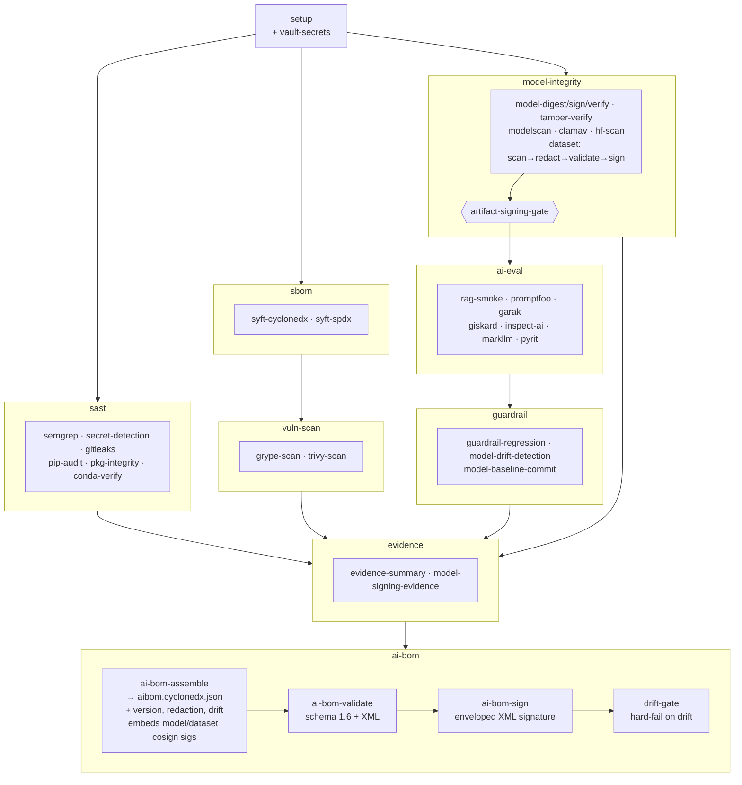

# GAIPS Materials

This directory contains the concrete starter artifacts and fixtures used by the GAIPS course docs. It is intentionally self-contained so a class can run without production accounts, private credentials, gated models, or undefined instructor assets.

## Directory Map

| Directory | Purpose |
| --- | --- |
| `starter-rag-app/` | Minimal capstone RAG app used when no class app exists. |
| `model-gateway/` | Reference provider wrapper and model-call evidence logging contract. |
| `data/` | Approved documents plus a benign malicious test document. |
| `evals/` | Promptfoo, garak, Giskard, Inspect AI, MarkLLM, and PyRIT lab instructions/config. |
| `evals/markllm.md` | MarkLLM watermark-readiness lab guidance for CI evidence and model-output provenance review. |
| `fixtures/` | Static red-team and eval outputs for fixture-mode labs. |
| `guardrails/` | Prompt Guard, Llama Guard 3, Model Armor, and regression fixtures. |
| `mcp/` | Lab-safe Cline MCP configuration. |
| `agent/` | Lab-safe agent fixture for tool permission and HackAgent review. |
| `buttercup/` | Automated vulnerability finding and patch-review fixture. |
| `ci/` | GitLab AI/ML security pipeline requiring project-level scripts, model artifacts, SBOM/vulnerability tooling, model-integrity checks, AI evals, and evidence outputs. See `ci/SBOM.md` for the pipeline's own dependency bill of materials. |
| `hugging-face-hub/` | Hub scanner and repository-settings review fixture. |
| `deployment/` | Kubernetes, Weaviate components, Weaviate `values.yaml` TLS/encryption review, gRPC LoadBalancer, and Vault review fixtures. |
| `model-signing/` | Signed, unsigned, and tampered artifact review fixture. |
| `sagemaker/` | Sanitized Hugging Face Estimator notebook and training-script fixture. |
| `bedrock-knowledge-bases/` | Bedrock Knowledge Bases design-review fixture. |
| `model-customization/` | Completed Lab 12 customization matrix. |
| `scripts/csv_to_jsonl.py` | CSV-to-JSONL converter for training, eval, and ChatML-style message datasets. |
| `scripts/weaviate_ollama_sdk_example.py` | Weaviate Python SDK example that maps a collection to an Ollama-hosted embedding model. |

## Student Copy Pattern

For a standalone lab repository, copy the needed subdirectories into the lab root:

```bash
mkdir -p gaips-labs
cp -R docs/gaips-materials/starter-rag-app gaips-labs/app
cp -R docs/gaips-materials/data gaips-labs/data
cp -R docs/gaips-materials/evals gaips-labs/evals
cp -R docs/gaips-materials/fixtures gaips-labs/fixtures
cp -R docs/gaips-materials/guardrails gaips-labs/guardrails
cp docs/gaips-materials/ci/.gitlab-ci.yml gaips-labs/.gitlab-ci.yml
```

Students should still explain each result. Fixture mode replaces unavailable execution, not analysis.

## CSV To JSONL Dataset Conversion

Use `scripts/csv_to_jsonl.py` when a lab receives a CSV training or eval dataset but the model, eval, or fine-tuning workflow expects JSONL. The script uses only the Python standard library.

Default ChatML-style conversion expects `prompt` and `completion` columns:

```bash
python docs/gaips-materials/scripts/csv_to_jsonl.py \
  --input data/training.csv \
  --output data/training.jsonl \
  --schema chatml
```

Optional developer/system instructions may be supplied with `--system-column system`. For raw row preservation, use `--schema records`. For simple prompt/completion JSONL, use `--schema prompt-completion`.

Before conversion, verify the CSV contains only approved synthetic or sanitized data. After conversion, record row count, schema, source path, output path, and any redaction performed in lab evidence.

## CI Execution Policy

`ci/.gitlab-ci.yml` is a GitLab AI/ML security pipeline. It is intended for a lab repository that contains project-level dependencies, scripts, model artifacts, prompt/eval config, and guardrail baselines.

The pipeline stages are `setup`, `sast`, `sbom`, `vuln-scan`, `model-integrity`, `ai-eval`, `guardrail`, `evidence`, and `ai-bom`. It produces Git version provenance, Semgrep, `pip-audit`, package-integrity, conda verification, Syft CycloneDX/SPDX, Grype, Trivy, ModelScan, Hugging Face artifact scan, model digest/signature/tamper, dataset redaction (secrets + PII), eval-dataset schema validation, Promptfoo, garak, Giskard, Inspect AI, MarkLLM watermark-readiness, PyRIT, guardrail-regression, model-drift detection, evidence, and a consolidated CycloneDX 1.6 AI BOM artifact.

Before copying this CI file into a student lab repository, add or adapt `requirements.txt`, `models/`, `promptfooconfig.yaml`, `guardrails/baseline.json`, `scripts/rag_smoke_eval.py`, `scripts/pyrit_scan.py`, `scripts/guardrail_regression.py`, `scripts/evidence_summary.py`, `scripts/build_ai_bom.py`, `scripts/write_version_info.py`, `scripts/validate_eval_dataset.py`, `scripts/redact_dataset.py`, `scripts/detect_model_drift.py`, `evals/eval-dataset.schema.json`, and (after the first run seeds it) `evals/eval-baseline.json`. Configure endpoint, signing, and Hugging Face variables in GitLab CI/CD settings. Fixture files under `docs/gaips-materials/fixtures/` remain offline interpretation aids, not automatic CI pass-throughs.

## Pipeline Walkthrough

Jobs within each stage run in parallel unless a `needs:` dependency forces sequencing.

### Process Flow

The pipeline is a DAG: the `model-integrity` stage converges on `artifact-signing-gate`, which blocks all AI evaluation until model and dataset integrity is proven. The terminal `ai-bom` stage rolls every prior element into one signed CycloneDX 1.6 AI BOM. (Rendered natively by GitLab.)



### Stage 1 — Setup

| Job | What it does |
| --- | --- |
| `setup` | Installs Python dependencies, creates `evidence/`, `sbom/`, and `reports/` directories, stamps pipeline ID and commit SHA into `evidence/pipeline.env`, and records Git/CI version provenance (commit, `git describe`, tag, branch, dirty state) to `evidence/version-info.json` for traceability of every downstream artifact. |
| `vault-secrets` | Authenticates to Vault using a GitLab OIDC JWT and fetches six secrets (`MODEL_ENDPOINT`, `MODEL_SIGNING_IDENTITY`, `SIGSTORE_OIDC_ISSUER`, `HF_TOKEN`, `GEMINI_API_KEY`, `CI_REGISTRY_TOKEN`) into a dotenv artifact injected as environment variables into all downstream jobs. Falls back to GitLab CI/CD variables if `VAULT_ADDR` is not set. |

### Stage 2 — SAST

| Job | What it does |
| --- | --- |
| `semgrep-sast` | Runs Semgrep `--config=auto` across the full codebase; outputs a GitLab SAST report. |
| `pip-audit` | Audits `requirements.txt` against OSV, PyPI advisory DB, and GitHub Advisory DB; outputs JSON and CycloneDX (use CycloneDX for CVSS score analysis). |
| `pkg-integrity` | Checks for hash-pinning in `requirements.txt`; generates a hashed lockfile if absent; verifies no dependency conflicts in an isolated venv via `pip check`. |
| `conda-pkg-verify` | Re-verifies the same packages in a `conda-forge`-only conda environment with strict channel priority; produces a reproducible environment manifest. |

### Stage 3 — SBOM

| Job | What it does |
| --- | --- |
| `syft-cyclonedx` | Generates a Software Bill of Materials in CycloneDX JSON and XML formats. |
| `syft-spdx` | Generates a Software Bill of Materials in SPDX JSON and tag-value formats. |

### Stage 4 — Vulnerability Scan

| Job | What it does |
| --- | --- |
| `grype-scan` | Feeds the CycloneDX SBOM into Grype and scans for known CVEs; outputs a JSON findings report and a human-readable table. |
| `trivy-scan` | Runs Trivy against the filesystem and the container image (if a registry image exists for this commit); outputs a GitLab container scanning report. |

### Stage 5 — Model Integrity

This stage runs as a sequential chain that fans out into parallel checks before converging on a hard gate.

**Sequential chain:**

1. **`model-signing-install`** — Installs the `model-signing` and `sigstore` Python packages; downloads and installs the `cosign` Go binary from GitHub releases.
2. **`model-digest`** — SHA-256 hashes every model file (`.pkl`, `.pt`, `.safetensors`, `.gguf`, `.bin`, `.h5`, `.onnx`) under `models/` and writes the digest list to `evidence/model-digests.txt`.
3. **`model-sign`** — Gets a `SIGSTORE_ID_TOKEN` OIDC JWT (audience `"sigstore"`) from GitLab and runs `python -m model_signing sign sigstore` on each subdirectory under `models/`, producing a `model.sig` Sigstore bundle inside each one. Publishes the `.sig` files as artifacts.

**Parallel checks (run after `model-digest` or `model-sign`):**

| Job | What it does |
| --- | --- |
| `signature-verification` | Finds every `model.sig` produced by `model-sign` and calls `python -m model_signing verify sigstore` on each, validating the signature against `MODEL_SIGNING_IDENTITY` and `SIGSTORE_OIDC_ISSUER` from Vault. A failed verification fails the job. |
| `tamper-verification` | Compares the current digest list against a stored baseline. On first run, seeds the baseline. On subsequent runs, any digest change prints a diff and fails. Baseline is stored in Vault (`secret/data/gaips/tamper-baseline/{project-slug}`) for permanent storage; falls back to a 90-day GitLab artifact when Vault is unavailable. |
| `modelscan` | Runs ModelScan across `models/` to detect malicious serialization payloads (pickle exploits, unsafe operators). Fails immediately on any CRITICAL finding. |
| `hf-artifact-scan` | Downloads each HuggingFace model listed in `HF_MODEL_IDS` and runs ModelScan against it. Skips cleanly if `HF_MODEL_IDS` is not set. |
| `dataset-scan` → `dataset-redact` → `eval-dataset-validate` → `dataset-sign` | The downloaded training/eval data runs a four-step chain: **(1)** `dataset-scan` — ClamAV + structural scan (hard gate); **(2)** `dataset-redact` — strips secrets (gitleaks) and PII (Microsoft Presidio) **in place**, so confidential data never reaches signing/eval (report records counts only, never raw values). Fail-closed (`allow_failure: false`); after redacting, the job **hard-fails** if findings exceed `REDACT_MAX_SECRETS` (default `0` — any secret in training data fails the run) or `REDACT_MAX_PII` (default `-1` — disabled); **(3)** `eval-dataset-validate` — validates every record against `evals/eval-dataset.schema.json` (fails the run on off-contract data, gating the AI-eval stage); **(4)** `dataset-sign` — `cosign sign-blob` over the **redacted, validated** bytes (`SIGSTORE_ID_TOKEN`, audience `"sigstore"`) → `dataset.sig` / `dataset.pem`, giving data the same Sigstore provenance as models. Every step skips cleanly when no dataset is configured (labs run on built-in fixtures). |

**Gate:**

**`artifact-signing-gate`** — Waits for all four parallel checks. Confirms `tamper_check_passed=true`. Nothing in the AI evaluation stage runs until this gate passes.

### Stage 6 — AI Evaluation

All jobs run in parallel after the gate passes.

| Job | What it does |
| --- | --- |
| `rag-smoke-eval` | Runs a local RAG smoke test against the GAIPS course materials. |
| `promptfoo-eval` | Runs adversarial prompt evaluations defined in `evals/promptfoo.yaml`. |
| `garak-scan` | Probes the live model endpoint (from `MODEL_ENDPOINT`) with all Garak probe modules to test for jailbreaks, extraction, and unsafe outputs. |
| `giskard-scan` | Runs Giskard's LLM scan against the live model for bias, hallucination, and prompt injection. |
| `inspect-ai-eval` | Runs structured capability and safety evaluations using `inspect-ai`. Uses project task files if present; otherwise runs MMLU (knowledge), TruthfulQA (honesty), WMDP bio/chem/cyber (hazard refusal), and GDM in-house CTF (agent safety). |
| `markllm-watermark-eval` | Tests whether model outputs can be watermark-detected using MarkLLM. |
| `pyrit-scan` | Runs Microsoft PyRIT adversarial probes against the model endpoint. |

### Stage 7 — Guardrail Regression

| Job | What it does |
| --- | --- |
| `guardrail-regression` | Waits for `promptfoo-eval` and `pyrit-scan`. Compares current results against a baseline to detect regressions — catches cases where a previously-blocked attack now succeeds. |
| `model-drift-detection` | Extracts normalised eval metrics (Inspect score/pass-rate, garak/pyrit/RAG/guardrail pass-rates, Giskard high-finding count, Promptfoo pass-rate) and compares them to the committed baseline `evals/eval-baseline.json`. Any metric moving beyond `DRIFT_THRESHOLD` (default ±0.10) flags model/behaviour drift on the same eval set. Report producer only (`allow_failure: true`) — the enforcing gate is `drift-gate` in the `ai-bom` stage. On first run (no baseline) it seeds `eval-baseline.seed.json`. |
| `model-baseline-commit` | **Automates baseline activation.** On the default branch, when a baseline was just seeded and none exists in the repo, commits `eval-baseline.seed.json` → `evals/eval-baseline.json` and pushes (with `[skip ci]` + `-o ci.skip`, so no pipeline loop). Requires `GITLAB_PUSH_TOKEN` (Project Access Token, scope `write_repository`); if unset, falls back to the manual artifact. Never overwrites an existing baseline. `allow_failure: true` — a failed auto-commit never breaks the build. |

### Stage 8 — Evidence

| Job | What it does |
| --- | --- |
| `evidence-summary` | Collects all reports from every prior job and renders a human-readable Markdown evidence summary to `evidence/evidence-summary.md`. Retained for 90 days. |
| `model-signing-evidence` | Builds a JSON bundle containing pipeline ID, commit SHA, branch, timestamp, and the full model digest list. Signs it with `cosign sign-blob` using the GitLab `SIGSTORE_ID_TOKEN`, producing a `.sig` and `.pem` certificate — a tamper-evident, publicly-verifiable record of the pipeline run. |

### Stage 9 — AI BOM

The final stage rolls every prior element into **one CycloneDX 1.6 AI BOM** — the single attestable inventory an auditor reads to see *all* elements of the system: software libraries, ML models, datasets, and evaluation evidence together.

| Job | What it does |
| --- | --- |
| `ai-bom-assemble` | Runs `scripts/build_ai_bom.py`, merging the Syft software SBOM (`library` components), models (`machine-learning-model` components with a `modelCard`, digest, ModelScan/ClamAV/Hugging Face verdicts, and the embedded `model.sig`), datasets (`data` components with digest, scan verdict, and embedded `dataset.sig`), and AI-eval results (root-component properties + external references) into `sbom/aibom.cyclonedx.json`. The per-component **cosign** signatures for models and datasets are embedded here as base64 `data:`-URI external references; the BOM's own signature is applied downstream by `ai-bom-sign`. It also folds in **Git version provenance** (from `version-info.json`), the **dataset redaction** verdict (redacted SHA + secret/PII counts, so the `data` component hash reflects the redacted bytes), and the **model-drift** verdict. Each input is optional, so the BOM degrades gracefully as stages light up. Retained for 90 days. |
| `ai-bom-validate` | Validates the BOM against the CycloneDX 1.6 JSON schema with `cyclonedx validate --fail-on-errors`, then converts it to `sbom/aibom.cyclonedx.xml` — the form the next job signs. Advisory (`allow_failure: true`) so a schema slip never blocks delivery of the BOM artifact. |
| `ai-bom-sign` | Applies the BOM's **own** signature as a native CycloneDX **enveloped signature** (`cyclonedx sign bom`, an XML Digital Signature embedded directly in `aibom.cyclonedx.xml`), then proves it with `cyclonedx verify all`. Unlike a detached signature, this verifies **as-is** — no canonical reconstruction. Uses a stable RSA key from `CYCLONEDX_SIGNING_KEY` / `CYCLONEDX_SIGNING_PUB` when configured, else an ephemeral keypair (intra-run verification only). The private key is never published; the public key ships as `aibom-signing.pub` for offline verification. Models and datasets keep their cosign/Sigstore signatures (embedded by `ai-bom-assemble`); only the BOM document itself moves to enveloped signing. |
| `drift-gate` | The hard gate for model drift. Runs **last** — after the BOM is built and signed — and fails the pipeline (`allow_failure: false`) when `model-drift-detection` reported drift. Placing it here means a drifted run still produces a signed BOM that **records** the drift, rather than a blocked pipeline that explains nothing. Passes on a clean run, a freshly-seeded baseline, or when drift detection was skipped. |
