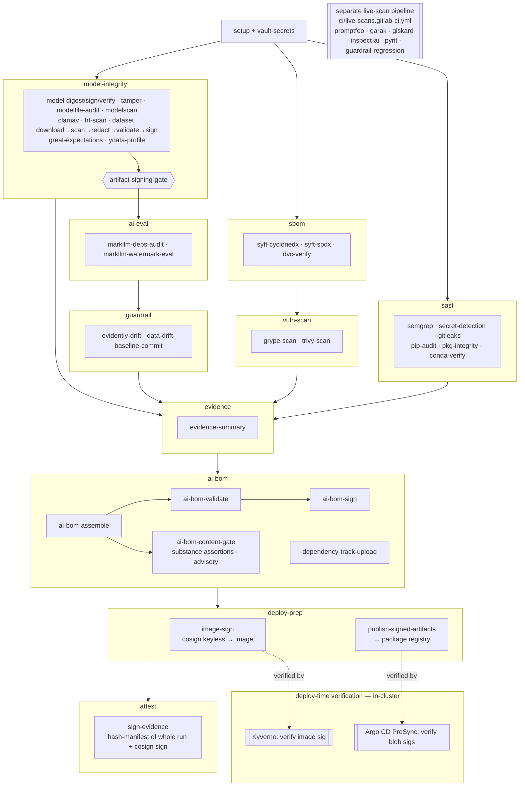

# GAIPS CI Pipeline — Software Bill of Materials

**Pipeline:** `.gitlab-ci.yml` (repo root)  
**Date:** 2026-06-08  
**Last updated:** 2026-06-19  
**Scope:** All tools, images, and packages installed or invoked by the pipeline at runtime. This is the pipeline's own dependency surface — not the project code it scans.

> **Out of scope — offline ingest tooling.** `scripts/parquet_to_jsonl.py` converts a Hugging Face Parquet split to schema-valid JSONL and needs `pyarrow`, but it runs **once, offline, before commit** — it is never installed or invoked by any CI job. `pyarrow` is therefore deliberately absent from the package tables below; the CI dataset chain operates only on the committed JSONL.

> **Pin status key**  
> ✅ Pinned — explicit version locked in the CI file  
> ⚠️ Unpinned — installs latest at job runtime; pin before production use

---

## Process Flow

The pipeline is a DAG across ten stages. `model-integrity` converges on `artifact-signing-gate` (no AI eval runs until model + dataset integrity is proven); `ai-bom` consolidates everything into one signed CycloneDX 1.6 AI BOM; `deploy-prep` signs the workload image and publishes the signed artifacts, closing the sign→verify loop that **Kyverno** (image) and the **Argo CD PreSync hook** (model/dataset/AI-BOM) enforce in-cluster (dashed edges). See `../README.md` → *Pipeline Walkthrough* for the per-job detail.

---

> **Live-scan pipeline dependencies.** Rows marked **(live-scan)** below are pulled
> only by the endpoint-dependent evals, which now run in the separate
> [`ci/live-scans.gitlab-ci.yml`](live-scans.gitlab-ci.yml) pipeline — not this one.
> They are listed here for completeness; this pipeline no longer installs them.

## Container Images

| Image | Tag | Used by | Pin status |
| --- | --- | --- | --- |
| `python` | `3.11-slim` | All jobs (default) | ⚠️ Unpinned minor — use `python:3.11.x-slim` with digest |
| `python` | `3.10-slim` | `markllm-watermark-eval`, `markllm-deps-audit` | ⚠️ Unpinned minor |
| `registry.gitlab.com/security-products/secrets` | `4` | `secret-detection` | ✅ Pinned (major tag) — pin to a digest for full reproducibility |
| `gitleaks/gitleaks` | `v8.30.1` | `gitleaks-scan` | ✅ Pinned via `IMAGE_GITLEAKS` (matches the `GITLEAKS_VERSION` binary; distinct from the checksum-pinned `gitleaks` binary in `dataset-redact`) |
| `clamav/clamav` | `1.4` | `clamav-scan` | ✅ Pinned via `IMAGE_CLAMAV` (patch-floating line, like `python:3.11-slim`; append a digest for full reproducibility. Also `apt-get`-installed in `hf-artifact-scan`, `dataset-scan`) |
| `semgrep/semgrep` | `1.165.0` | `semgrep-sast` | ✅ Pinned (`IMAGE_SEMGREP`; the job runs in this image — no `pip install semgrep`) |
| `continuumio/miniconda3` | `26.3.2` | `conda-pkg-verify` | ✅ Pinned |
| `anchore/syft` | `v1.45.1-debug` | `syft-cyclonedx`, `syft-spdx` | ✅ Pinned (`-debug` variant ships a shell for the wrapper scripts) |
| `anchore/grype` | `v0.114.0-debug` | `grype-scan` | ✅ Pinned (`-debug` variant ships a shell) |
| `aquasec/trivy` | `0.71.1` | `trivy-scan` | ✅ Pinned (no `v` prefix; keep in sync with the trivy-db schema) |
| `cyclonedx/cyclonedx-cli` | `0.32.0` | `ai-bom-validate`, `ai-bom-sign` | ✅ Pinned |
| `node` | `20-slim` | `promptfoo-eval` **(live-scan)** | ⚠️ Unpinned minor |

---

## Binary Tools (installed at job runtime)

| Tool | Version | Source | Used by | Pin status |
| --- | --- | --- | --- | --- |
| `cosign` | `v2.4.1` | `github.com/sigstore/cosign/releases` | `model-signing-install`, `dataset-sign`, `sign-evidence`, `image-sign` (4 install sites) | ✅ Pinned + checksum verified |
| `gitleaks` | `8.30.1` | `github.com/gitleaks/gitleaks/releases` | `dataset-redact` | ✅ Pinned + checksum verified |
| `promptfoo` | `0.121.15` | `npm install -g promptfoo` | `promptfoo-eval` **(live-scan)** | ✅ Pinned |

---

## Python Packages (pip install)

All packages below are installed fresh in each job container. None are pinned in the CI file — each installs the latest available version at pipeline runtime.

| Package | Extras | Used by | Pin status | Notes |
| --- | --- | --- | --- | --- |
| `model-signing` | — | `model-signing-install`, `model-digest`, `model-sign`, `signature-verification` | ⚠️ Unpinned | Core signing/verification library; pin to avoid breaking API changes (`sign-evidence` no longer installs it — it signs with cosign only) |
| `sigstore` | — | `model-signing-install`, `model-sign`, `signature-verification` | ⚠️ Unpinned | Sigstore Python SDK; used for keyless signing via Fulcio/Rekor |
| `hvac` | — | `vault-secrets`, `tamper-verification` | ⚠️ Unpinned | HashiCorp Vault Python client |
| `pip-audit` | — | `pip-audit` | ⚠️ Unpinned | Audits `requirements.txt` against OSV and advisory DBs |
| `pip-tools` | — | `pkg-integrity` | ⚠️ Unpinned | `pip-compile` for generating hashed lockfiles |
| `modelscan` | — | `modelscan`, `hf-artifact-scan` | ⚠️ Unpinned | Detects malicious serialization payloads in model files |
| `huggingface_hub` | — | `hf-artifact-scan` | ⚠️ Unpinned | Downloads HuggingFace model snapshots for scanning |
| `garak` | — | `garak-scan` **(live-scan)** | ⚠️ Unpinned | Adversarial LLM probe framework |
| `giskard` | `[llm]` | `giskard-scan` **(live-scan)** | ⚠️ Unpinned | LLM vulnerability scanner (bias, hallucination, injection) |
| `requests` | — | `giskard-scan` **(live-scan)** | ⚠️ Unpinned | HTTP client (transitive dep; listed explicitly) |
| `pandas` | — | `giskard-scan` **(live-scan)** | ⚠️ Unpinned | Data manipulation (required by giskard) |
| `inspect-ai` | — | `inspect-ai-eval` **(live-scan)** | ⚠️ Unpinned | Structured AI evaluation framework |
| `inspect-evals` | — | `inspect-ai-eval` **(live-scan)** | ⚠️ Unpinned | Built-in eval tasks (MMLU, TruthfulQA, WMDP, GDM CTF) |
| `markllm` | — | `markllm-watermark-eval` | ⚠️ Unpinned | LLM watermark detection |
| `torch` | — | `markllm-watermark-eval` | ⚠️ Unpinned | PyTorch (required by markllm) |
| `transformers` | — | `markllm-watermark-eval` | ⚠️ Unpinned | Hugging Face Transformers (required by markllm) |
| `pyrit` | — | `pyrit-scan` **(live-scan)** | ⚠️ Unpinned | Microsoft PyRIT adversarial red-teaming framework |
| `jsonschema` | — | `eval-dataset-validate` | ⚠️ Unpinned | Draft-07 validation of eval dataset records against `evals/eval-dataset.schema.json` |
| `presidio-analyzer` | — | `dataset-redact` | ⚠️ Unpinned | Microsoft Presidio PII detection (pulls in `spacy`) |
| `presidio-anonymizer` | — | `dataset-redact` | ⚠️ Unpinned | Presidio PII redaction/anonymization |
| `spacy` (`en_core_web_sm`) | — | `dataset-redact` | ⚠️ Unpinned | NLP model for Presidio; fetched via `python -m spacy download` |
| `jinja2` | — | `evidence-summary` | ⚠️ Unpinned | Template rendering for evidence summary |
| `great-expectations` | — | `great-expectations-validate` | ⚠️ Unpinned | GX Core 1.x content-quality checkpoint (null rates, ranges, uniqueness) + Data Docs |
| `evidently` | — | `evidently-drift` | ⚠️ Unpinned | Data/feature drift (DataDriftPreset/PSI) + LLM TextEvals over the dataset |
| `ydata-profiling` | — | `ydata-profile` | ⚠️ Unpinned | Advisory dataset profile; pins narrow numpy/pandas/matplotlib ranges |
| `dvc` | `[all]` | `dvc-verify` | ⚠️ Unpinned | Data/model version lineage; verifies workspace vs pinned versions |
| `requests` | — | `dependency-track-upload` | ⚠️ Unpinned | HTTP client for the Dependency-Track REST API |
| `pandas` | — | `great-expectations-validate`, `evidently-drift`, `ydata-profile` | ⚠️ Unpinned | Dataset loading for the data-quality jobs |
| `pip` / `setuptools` / `wheel` | — | All Python jobs (before_script) | ⚠️ Unpinned | Upgraded to latest in every job before_script |

---

## Vault Integration Dependencies

| Component | Version | Notes |
| --- | --- | --- |
| HashiCorp Vault | ≥ 1.12 | Required for JWT auth backend and KV v2. Version set by your deployment. **HCP Vault Dedicated** (managed Vault Enterprise) is supported: set `VAULT_NAMESPACE` (`admin` or a child) on the `vault-secrets`/`tamper-verification` jobs — see `deployment/vault/sample-secret-map.md`. |
| Vault namespace | — | Blank for OSS Vault; `admin` (or `admin/gaips`) for HCP Vault / Enterprise. Wired via the `VAULT_NAMESPACE` CI variable (hvac `namespace=`) and Terraform `var.vault_namespace` (provider `namespace`). Secret paths are unchanged — they resolve inside the namespace. |
| Vault Terraform provider (`hashicorp/vault`) | `~> 4.0` | Pinned in `deployment/vault/terraform/main.tf`; provider `namespace` set from `var.vault_namespace`. |
| Terraform | ≥ 1.6 | Required by `deployment/vault/terraform/main.tf` |
| GitLab `id_tokens` | GitLab ≥ 15.7 | Required for OIDC JWT issuance (`VAULT_ID_TOKEN`, `SIGSTORE_ID_TOKEN`). Falls back to `CI_JOB_JWT_V2` on older instances (deprecated in GitLab 16.x). HCP Vault must be able to reach the GitLab JWKS endpoint to validate these tokens. |

---

## Remediation Status

| Risk | Status | Notes |
| --- | --- | --- |
| `cosign` binary downloaded with no checksum verification | ✅ Fixed | All four install sites (`model-signing-install`, `dataset-sign`, `sign-evidence`, `image-sign`) download `cosign_checksums.txt` and verify via `sha256sum --check --strict` before installing |
| `promptfoo` unpinned | ✅ Fixed | Pinned to `0.121.15` via `PROMPTFOO_VERSION` (now in the separate [live-scan pipeline](live-scans.gitlab-ci.yml)) |
| `torch` + `transformers` unaudited | ✅ Fixed | New `markllm-deps-audit` job runs `pip-audit` against `torch`, `transformers`, and `markllm` before `markllm-watermark-eval` |
| Current CI blocked by historic secret fixtures | ✅ Scoped | GitLab native `secret-detection` remains a hard gate, but runs against the current HEAD checkout (`GIT_DEPTH: 1`, `SECRET_DETECTION_LOG_OPTIONS="--max-count=1"`). Use one-off historic scans/history cleanup for old fixtures instead of blocking every current pipeline. |
| Advisory eval failures discarded evidence | ✅ Fixed | `markllm-watermark-eval` uploads artifacts with `when: always`. `promptfoo-eval` (now in the separate [live-scan pipeline](live-scans.gitlab-ci.yml)) does the same and writes a minimal failure JSON when the tool exits before producing its report. |
| Superseded pipelines consuming runner minutes | ✅ Mitigated | Pipeline jobs are `interruptible: true`. Enable GitLab project auto-cancel redundant pipelines so newer pushes cancel obsolete jobs during debugging. |
| Container images use `:latest` | ✅ Fixed | All scanner images pinned via `IMAGE_*` variables at top of CI file: `semgrep/semgrep:1.165.0`, `continuumio/miniconda3:26.3.2`, `anchore/syft:v1.45.1-debug`, `anchore/grype:v0.114.0-debug`, `aquasec/trivy:0.71.1`, `cyclonedx/cyclonedx-cli:0.32.0`, **`gitleaks/gitleaks:v8.30.1`** (`IMAGE_GITLEAKS`), and **`clamav/clamav:1.4`** (`IMAGE_CLAMAV`). No job uses `:latest` anymore. `registry.gitlab.com/security-products/secrets:4` is pinned at a major tag; `python:3.11-slim`/`python:3.10-slim`/`node:20-slim` remain unpinned at minor version. **Remaining hardening:** append `@sha256:…` digests for byte-exact reproducibility. |
| All pip packages unpinned | ✅ Structured | `ci/requirements-ci.in` created listing all pipeline packages. **Remaining action:** run `pip-compile --generate-hashes requirements-ci.in` on a Python 3.11-slim Linux container to produce `requirements-ci.txt`, commit it, then switch each CI job from inline `pip install` to `pip install -r ci/requirements-ci.txt` |
| Verify-at-deploy loop half-wired (image unsigned; PreSync hook had nothing to fetch) | ✅ Fixed | `deploy-prep` stage added: `image-sign` (Cosign keyless → matches the Kyverno policy identity) and `publish-signed-artifacts` (signed AI-BOM + dataset → Generic Package Registry, the path the Argo CD PreSync hook fetches). PreSync hook corrected to verify the model with `model_signing` (not `cosign verify-blob`). **Remaining action:** set `IMAGE_REF`, point the PreSync `ARTIFACT_BASE_URL` at the package path, and flip Kyverno to `Enforce` once a signed digest is confirmed. |
| AI-BOM recorded known vulns only as property counts (no structured `vulnerabilities[]`) | ✅ Fixed (#29) | `build_ai_bom.py` emits a CycloneDX `vulnerabilities[]` from pip-audit (`markllm-deps-audit` + per-job `pip-audit-*`), grype, and trivy, deduped, with `affects[].ref` → component `bom-ref`s. Dependency-Track now ingests structured vulns. |
| AI-BOM fused two disjoint dependency universes into one count + hollow `modelCard` | ✅ Fixed (#30) | Software count split into `bom.counts.software.pipeline` vs `…software.markllm` with `gaips:source` labels; `modelCard` populated from `markllm-results.json`. **Remaining:** the pipeline-side closure is only as deep as `syft-cyclonedx` (transitive-shallow) — tracked as #35. |
| AI-BOM validation checked form, not substance | ✅ Fixed (#31, advisory) | New `ai-bom-content-gate` (`assert_ai_bom_content.py`, `python:3.11-slim`) asserts audit-found-vulns ⇒ non-empty `vulnerabilities[]`, models signed + verified. Advisory (`allow_failure: true`); `--enforce` for teeth once green. |
| "Signed ≠ verified" + absolute artifact paths | ✅ Fixed (#32) | `model-digest` records repo-relative paths (clears #40-F4/#41-F5); `build_ai_bom` + `sign-evidence` emit `model.verified`/`verified_reason` from `signature-verification` #19 (honestly `false`/deferred until #19 on a protected ref). |
| Evidence-summary gate checked file presence, not verdicts | ✅ Fixed (#33, WARN-first) | `write_ci_evidence_summary.py` reads 3-state verdicts (pass/fail/inert); missing-required still hard-fails, present-but-failing warns by default and blocks under `--enforce-verdicts`. |
| Dependency-Track policy gate not wired (best-built gate inert) | 🟡 Infra-ready (#34) | Client code complete; turnkey [`deployment/dependency-track/`](../deployment/dependency-track/) (docker-compose + runbook) added. **Remaining action:** stand up the instance, set `DT_API_URL`/`DT_API_KEY`, define a `FAIL` policy, validate on a re-run. |
| AI-BOM `data` components carried no provenance/license (asymmetric with models, which fold in full HF metadata) | ✅ Fixed | `build_ai_bom.py` now reads the reviewed `evals/dataset-baseline.json` (via `--dataset-baseline`) and stamps a CycloneDX `licenses` entry (SPDX `MIT`) plus `gaips:dataset.source/.revision/.split/.citation` onto the dataset component. Paired with `evals/dataset-baseline.json` as the single source of truth for `DATASET_EXPECTED_SHA256`. |
| Dataset-tamper detection required a package registry (fixture mode applied no integrity pin) | ✅ Fixed | `dataset-download` now verifies the committed fixture against `DATASET_EXPECTED_SHA256` in fixture mode too (configurable via `DATASET_FIXTURE_FILE`). The check is on raw pre-redaction bytes, so it is deterministic. Default fixture is the Lakera `gandalf_ignore_instructions` test split (112 records, MIT). |
| Runner disk exhaustion (`[Errno 28] No space left on device`) on `saas-linux-small` | ✅ Mitigated | Two compounding causes: (1) unpinned heavy deps (`modelaudit[all]`, the torch/tensorflow/CUDA MarkLLM stack) grew over time past the small runner's ephemeral disk; (2) a bloated shared pip cache (`key: pip-<ref>`, `pull-push`) accumulated those wheels and every job re-restored it. **Fix:** bumped the cache key to `pip-v2-<ref>` (abandons the bloat); `cache: {}` on the bloaters (`markllm-watermark-eval`, `modelaudit-scan`, `lockfile-audit`) so they no longer restore/save it; moved `modelaudit-scan` and `markllm-watermark-eval` to **`saas-linux-medium-amd64`** (disk headroom; ~2× minutes for those two jobs). **Durable action (still open):** pin the dependency set (`requirements-ci.txt`) so dep growth can't silently re-trigger this. |
| Presidio over-redaction corrupted record identifiers (`id` mis-tagged `DATE_TIME`/`PERSON`) | ✅ Fixed | `redact_dataset.py` now leaves structural eval-dataset contract keys un-redacted (`--skip-keys`, default `id,case_id,category`) — they are identifiers/labels, not free-text PII. Previously redaction collapsed 112 unique ids to 89, breaking great-expectations id-uniqueness and record identity in the signed dataset + AI-BOM. Free-text fields (`prompt`/`question`/`expected`) are still fully redacted; the report records `skipped_keys`. |
