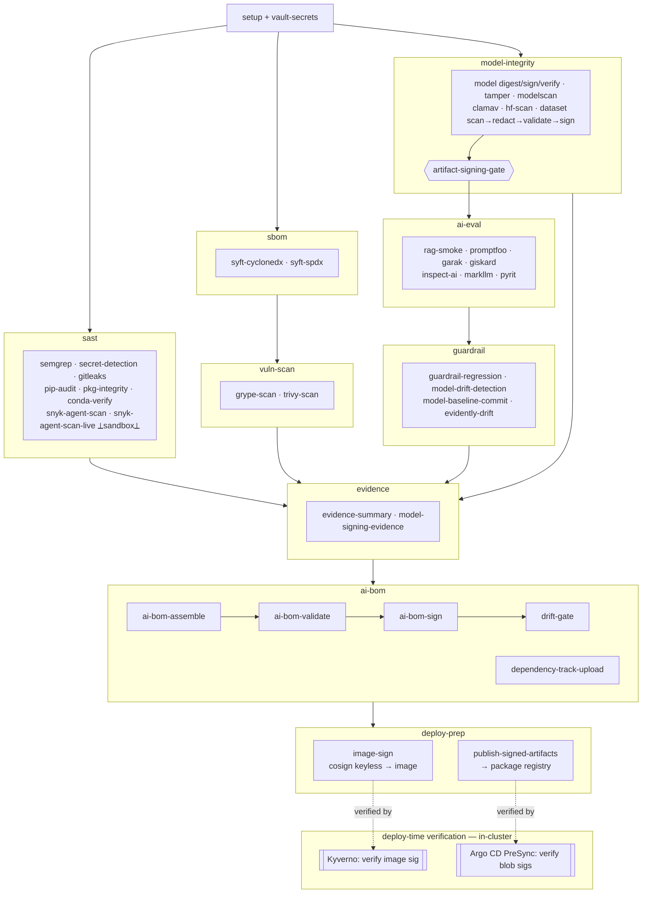

# GAIPS CI Pipeline — Software Bill of Materials

**Pipeline:** `ci/.gitlab-ci.yml`  
**Date:** 2026-06-08  
**Last updated:** 2026-06-13  
**Scope:** All tools, images, and packages installed or invoked by the pipeline at runtime. This is the pipeline's own dependency surface — not the project code it scans.

> **Pin status key**  
> ✅ Pinned — explicit version locked in the CI file  
> ⚠️ Unpinned — installs latest at job runtime; pin before production use

---

## Process Flow

The pipeline is a DAG across ten stages. `model-integrity` converges on `artifact-signing-gate` (no AI eval runs until model + dataset integrity is proven); `ai-bom` consolidates everything into one signed CycloneDX 1.6 AI BOM; `deploy-prep` signs the workload image and publishes the signed artifacts, closing the sign→verify loop that **Kyverno** (image) and the **Argo CD PreSync hook** (model/dataset/AI-BOM) enforce in-cluster (dashed edges). See `../README.md` → *Pipeline Walkthrough* for the per-job detail.

---

## Container Images

| Image | Tag | Used by | Pin status |
| --- | --- | --- | --- |
| `python` | `3.11-slim` | All jobs (default) | ⚠️ Unpinned minor — use `python:3.11.x-slim` with digest |
| `python` | `3.10-slim` | `markllm-watermark-eval`, `markllm-deps-audit` | ⚠️ Unpinned minor |
| `semgrep/semgrep` | `v1.165.0` | `semgrep-sast` | ✅ Pinned |
| `continuumio/miniconda3` | `26.3.2` | `conda-pkg-verify` | ✅ Pinned |
| `anchore/syft` | `v1.45.1` | `syft-cyclonedx`, `syft-spdx` | ✅ Pinned |
| `anchore/grype` | `v0.114.0` | `grype-scan` | ✅ Pinned |
| `aquasec/trivy` | `v0.71.0` | `trivy-scan` | ✅ Pinned |
| `cyclonedx/cyclonedx-cli` | `0.32.0` | `ai-bom-validate`, `ai-bom-sign` | ✅ Pinned |
| `node` | `20-slim` | `promptfoo-eval` | ⚠️ Unpinned minor |

---

## Binary Tools (installed at job runtime)

| Tool | Version | Source | Used by | Pin status |
| --- | --- | --- | --- | --- |
| `cosign` | `v2.4.1` | `github.com/sigstore/cosign/releases` | `model-signing-install`, `model-signing-evidence`, `dataset-sign`, `image-sign` | ✅ Pinned + checksum verified |
| `gitleaks` | `8.30.1` | `github.com/gitleaks/gitleaks/releases` | `dataset-redact` | ✅ Pinned + checksum verified |
| `promptfoo` | `0.121.15` | `npm install -g promptfoo` | `promptfoo-eval` | ✅ Pinned |
| `uv` / `uvx` | latest | `pip install uv` (PyPI) | `snyk-agent-scan`, `snyk-agent-scan-live` | ⚠️ Unpinned — pin `uv==x.y.z`; runs `snyk-agent-scan@latest` |
| `podman` | runner-provided | sandbox runner image | `snyk-agent-scan-live` (rootless nested container) | ⚠️ Runner prerequisite — version set by the `sandbox`-tagged runner |

---

## Python Packages (pip install)

All packages below are installed fresh in each job container. None are pinned in the CI file — each installs the latest available version at pipeline runtime.

| Package | Extras | Used by | Pin status | Notes |
| --- | --- | --- | --- | --- |
| `model-signing` | — | `model-signing-install`, `model-digest`, `model-sign`, `signature-verification`, `model-signing-evidence` | ⚠️ Unpinned | Core signing/verification library; pin to avoid breaking API changes |
| `sigstore` | — | `model-signing-install`, `model-sign`, `signature-verification`, `model-signing-evidence` | ⚠️ Unpinned | Sigstore Python SDK; used for keyless signing via Fulcio/Rekor |
| `hvac` | — | `vault-secrets`, `tamper-verification` | ⚠️ Unpinned | HashiCorp Vault Python client |
| `pip-audit` | — | `pip-audit` | ⚠️ Unpinned | Audits `requirements.txt` against OSV and advisory DBs |
| `pip-tools` | — | `pkg-integrity` | ⚠️ Unpinned | `pip-compile` for generating hashed lockfiles |
| `modelscan` | — | `modelscan`, `hf-artifact-scan` | ⚠️ Unpinned | Detects malicious serialization payloads in model files |
| `huggingface_hub` | — | `hf-artifact-scan` | ⚠️ Unpinned | Downloads HuggingFace model snapshots for scanning |
| `garak` | — | `garak-scan` | ⚠️ Unpinned | Adversarial LLM probe framework |
| `giskard` | `[llm]` | `giskard-scan` | ⚠️ Unpinned | LLM vulnerability scanner (bias, hallucination, injection) |
| `requests` | — | `giskard-scan` | ⚠️ Unpinned | HTTP client (transitive dep; listed explicitly) |
| `pandas` | — | `giskard-scan` | ⚠️ Unpinned | Data manipulation (required by giskard) |
| `inspect-ai` | — | `inspect-ai-eval` | ⚠️ Unpinned | Structured AI evaluation framework |
| `inspect-evals` | — | `inspect-ai-eval` | ⚠️ Unpinned | Built-in eval tasks (MMLU, TruthfulQA, WMDP, GDM CTF) |
| `markllm` | — | `markllm-watermark-eval` | ⚠️ Unpinned | LLM watermark detection |
| `torch` | — | `markllm-watermark-eval` | ⚠️ Unpinned | PyTorch (required by markllm) |
| `transformers` | — | `markllm-watermark-eval` | ⚠️ Unpinned | Hugging Face Transformers (required by markllm) |
| `pyrit` | — | `pyrit-scan` | ⚠️ Unpinned | Microsoft PyRIT adversarial red-teaming framework |
| `jsonschema` | — | `eval-dataset-validate` | ⚠️ Unpinned | Draft-07 validation of eval dataset records against `evals/eval-dataset.schema.json` |
| `presidio-analyzer` | — | `dataset-redact` | ⚠️ Unpinned | Microsoft Presidio PII detection (pulls in `spacy`) |
| `presidio-anonymizer` | — | `dataset-redact` | ⚠️ Unpinned | Presidio PII redaction/anonymization |
| `spacy` (`en_core_web_sm`) | — | `dataset-redact` | ⚠️ Unpinned | NLP model for Presidio; fetched via `python -m spacy download` |
| `jinja2` | — | `evidence-summary` | ⚠️ Unpinned | Template rendering for evidence summary |
| `great-expectations` | — | `great-expectations-validate` | ⚠️ Unpinned | GX Core 1.x content-quality checkpoint (null rates, ranges, uniqueness) + Data Docs |
| `evidently` | — | `evidently-drift` | ⚠️ Unpinned | Data/feature drift (DataDriftPreset/PSI) + LLM TextEvals over the dataset |
| `ydata-profiling` | — | `ydata-profile` | ⚠️ Unpinned | Advisory dataset profile; pins narrow numpy/pandas/matplotlib ranges |
| `dvc` | `[all]` | `dvc-verify` | ⚠️ Unpinned | Data/model version lineage; verifies workspace vs pinned versions |
| `requests` | — | `dependency-track-upload` (also `giskard-scan`) | ⚠️ Unpinned | HTTP client for the Dependency-Track REST API |
| `pandas` | — | `great-expectations-validate`, `evidently-drift`, `ydata-profile` (also `giskard-scan`) | ⚠️ Unpinned | Dataset loading for the data-quality jobs |
| `pip` / `setuptools` / `wheel` | — | All Python jobs (before_script) | ⚠️ Unpinned | Upgraded to latest in every job before_script |
| `uv` | — | `snyk-agent-scan`, `snyk-agent-scan-live` | ⚠️ Unpinned | Provides `uvx`; resolves `snyk-agent-scan` from PyPI (honours `UV_INDEX_URL`) |
| `snyk-agent-scan` | `@latest` (uvx) | `snyk-agent-scan`, `snyk-agent-scan-live` | ⚠️ Unpinned `@latest` | Agent/MCP/skill supply-chain scanner (Apache-2.0, `github.com/snyk/agent-scan`); pin to a release tag for reproducibility. Requires `SNYK_TOKEN`. Live job runs offline (`--no-bootstrap`) inside the sandbox |

---

## Vault Integration Dependencies

| Component | Version | Notes |
| --- | --- | --- |
| HashiCorp Vault | ≥ 1.12 | Required for JWT auth backend and KV v2. Version set by your deployment. |
| Vault Terraform provider (`hashicorp/vault`) | `~> 4.0` | Pinned in `deployment/vault/terraform/main.tf` |
| Terraform | ≥ 1.6 | Required by `deployment/vault/terraform/main.tf` |
| GitLab `id_tokens` | GitLab ≥ 15.7 | Required for OIDC JWT issuance (`VAULT_ID_TOKEN`, `SIGSTORE_ID_TOKEN`). Falls back to `CI_JOB_JWT_V2` on older instances (deprecated in GitLab 16.x). |

---

## Remediation Status

| Risk | Status | Notes |
| --- | --- | --- |
| `cosign` binary downloaded with no checksum verification | ✅ Fixed | Both install sites now download `cosign_checksums.txt` and verify via `sha256sum --check --strict` before installing |
| `promptfoo` unpinned | ✅ Fixed | Pinned to `0.121.15` via `PROMPTFOO_VERSION` variable at top of CI file |
| `torch` + `transformers` unaudited | ✅ Fixed | New `markllm-deps-audit` job runs `pip-audit` against `torch`, `transformers`, and `markllm` before `markllm-watermark-eval` |
| Container images use `:latest` | ✅ Fixed | All images pinned via `IMAGE_*` variables at top of CI file: `semgrep/semgrep:v1.165.0`, `continuumio/miniconda3:26.3.2`, `anchore/syft:v1.45.1`, `anchore/grype:v0.114.0`, `aquasec/trivy:v0.71.0`. `python:3.11-slim` and `node:20-slim` remain unpinned at minor version. |
| All pip packages unpinned | ✅ Structured | `ci/requirements-ci.in` created listing all pipeline packages. **Remaining action:** run `pip-compile --generate-hashes requirements-ci.in` on a Python 3.11-slim Linux container to produce `requirements-ci.txt`, commit it, then switch each CI job from inline `pip install` to `pip install -r ci/requirements-ci.txt` |
| Verify-at-deploy loop half-wired (image unsigned; PreSync hook had nothing to fetch) | ✅ Fixed | `deploy-prep` stage added: `image-sign` (Cosign keyless → matches the Kyverno policy identity) and `publish-signed-artifacts` (signed AI-BOM + dataset → Generic Package Registry, the path the Argo CD PreSync hook fetches). PreSync hook corrected to verify the model with `model_signing` (not `cosign verify-blob`). **Remaining action:** set `IMAGE_REF`, point the PreSync `ARTIFACT_BASE_URL` at the package path, and flip Kyverno to `Enforce` once a signed digest is confirmed. |
| Agent/MCP components unscanned | ✅ Fixed | `snyk-agent-scan` (static) scans the MCP config + skills; `snyk-agent-scan-live` runs the dangerous server-launching scan only manually, in a locked-down rootless sandbox container. `--no-pin`: `snyk-agent-scan@latest` runs via `uvx` — **pin to a release tag** before production. Requires masked `SNYK_TOKEN`. |
| `uv` / `snyk-agent-scan` / sandbox `podman` unpinned | ⚠️ Open | Pin `uv==x.y.z` and `snyk-agent-scan@<tag>`; record the `sandbox` runner's `podman` version once provisioned. |
